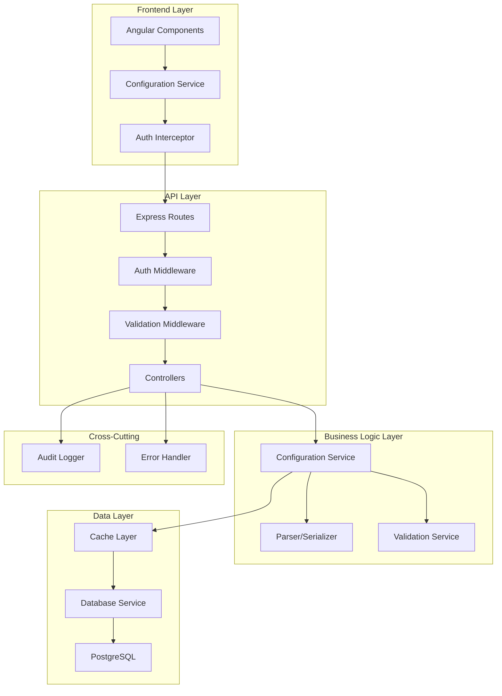
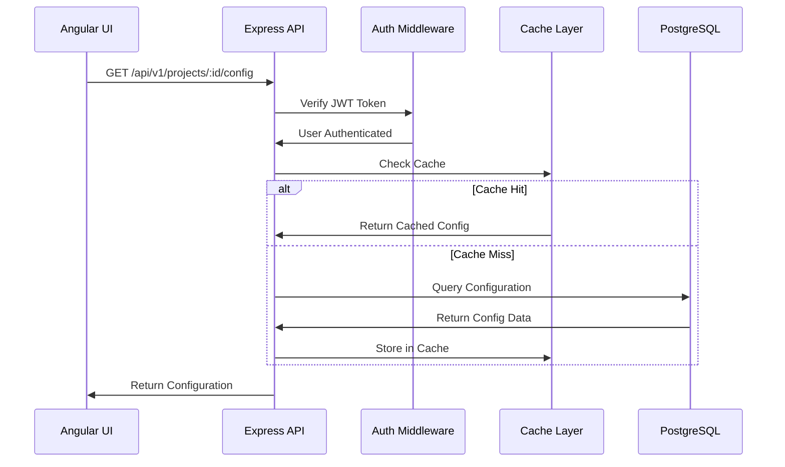
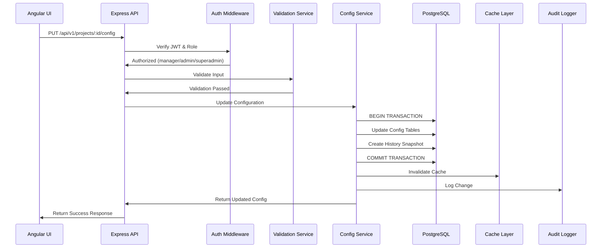

# Design Document: Project Configuration Management

## Overview

The Project Configuration Management module provides comprehensive settings and configuration capabilities for projects within the Ramiscope Project Management System. This module enables project administrators to customize project metadata, manage team members with project-specific roles, configure workflows and status transitions, define custom item types and fields, manage sprint settings, and control notification preferences.

### Prerequisites and Dependencies

**CRITICAL DEPENDENCY**: This module requires a **User/Member Management module** that does not currently exist in the system. The User/Member Management module must be implemented first to provide:

1. **User List API**: GET /api/v1/users - List all system users
2. **User Search API**: GET /api/v1/users/search - Search users by name/email
3. **User Details API**: GET /api/v1/users/:userId - Get user information
4. **User Management UI**: Angular components for user display and search

**Implementation Sequence**:
1. **Phase 1**: Implement User/Member Management module (separate spec required)
2. **Phase 2**: Implement Project Configuration Management module (this spec)

The Project Member Management feature will **reference existing system users** and assign them project-specific roles. It will NOT create new user accounts.

### Key Design Goals

1. **Multi-tenant isolation**: Ensure complete data isolation between projects
2. **Performance**: Achieve sub-200ms response times for cached configuration reads
3. **Extensibility**: Support custom fields, item types, and workflow configurations
4. **Auditability**: Track all configuration changes with complete history
5. **Integration**: Seamlessly integrate with existing JWT-based authentication and future User Management module
6. **Validation**: Enforce data integrity through comprehensive validation

### Technology Stack

- **Backend**: Node.js 18+ with Express 4.18.2
- **Database**: PostgreSQL 14+ with UUID primary keys
- **Caching**: node-cache (in-memory) for single-server deployment
- **Frontend**: Angular 21.2.0 with Angular Material UI
- **Authentication**: JWT tokens with role-based access control
- **Validation**: express-validator for API input validation

## Architecture

### High-Level System Architecture



### Data Flow Diagrams

#### Configuration Read Flow



#### Configuration Update Flow



### Component Interactions

The system follows a layered architecture pattern:

1. **Presentation Layer** (Angular): Handles user interactions and displays configuration UI
2. **API Layer** (Express Routes + Middleware): Handles HTTP requests, authentication, and validation
3. **Business Logic Layer** (Services): Implements configuration management logic
4. **Data Access Layer** (Database Service): Manages database operations and caching
5. **Cross-Cutting Concerns**: Audit logging, error handling, validation

## Components and Interfaces

### Backend Components

#### 1. Configuration Controller (`config.controller.js`)

Handles HTTP requests for configuration endpoints.

```javascript
/**
 * Configuration Controller
 * Handles HTTP requests for project configuration
 */

// GET /api/v1/projects/:projectId/config
const getConfiguration = async (req, res, next) => {
  // Returns complete project configuration
};

// PUT /api/v1/projects/:projectId/config
const updateConfiguration = async (req, res, next) => {
  // Updates complete project configuration
};

// PATCH /api/v1/projects/:projectId/config/:section
const updateConfigSection = async (req, res, next) => {
  // Updates specific configuration section
};

// GET /api/v1/projects/:projectId/config/history
const getConfigHistory = async (req, res, next) => {
  // Returns configuration change history
};

// POST /api/v1/projects/:projectId/config/export
const exportConfiguration = async (req, res, next) => {
  // Exports configuration as JSON
};

// POST /api/v1/projects/:projectId/config/import
const importConfiguration = async (req, res, next) => {
  // Imports configuration from JSON
};
```

#### 2. Configuration Service (`config.service.js`)

Implements business logic for configuration management.

```javascript
/**
 * Configuration Service
 * Business logic for project configuration
 */

const getProjectConfiguration = async (projectId, userId) => {
  // 1. Check cache
  // 2. If miss, query database
  // 3. Validate user access
  // 4. Parse and return configuration
};

const updateProjectConfiguration = async (projectId, userId, configData) => {
  // 1. Validate user permissions
  // 2. Validate configuration data
  // 3. Begin transaction
  // 4. Update configuration tables
  // 5. Create history snapshot
  // 6. Commit transaction
  // 7. Invalidate cache
  // 8. Log audit event
};

const validateConfiguration = async (configData) => {
  // Validates configuration integrity
  // - Required fields present
  // - Foreign key references exist
  // - Workflow has path to done status
  // - No circular transitions
};
```

#### 3. Configuration Parser/Serializer (`config.parser.js`)

Handles conversion between JSON and internal representations.

```javascript
/**
 * Configuration Parser
 * Parses JSON configuration into internal objects
 */

const parseConfiguration = (jsonConfig) => {
  // 1. Validate JSON schema
  // 2. Parse general settings
  // 3. Parse members and roles
  // 4. Parse workflow configuration
  // 5. Parse item types
  // 6. Parse custom fields
  // 7. Parse sprint configuration
  // 8. Parse notification rules
  // 9. Return parsed configuration object
};

const serializeConfiguration = (configObject) => {
  // 1. Convert internal objects to JSON
  // 2. Format with proper indentation
  // 3. Exclude sensitive data
  // 4. Map user IDs to usernames
  // 5. Return JSON string
};
```

#### 4. Cache Service (`cache.service.js`)

Manages in-memory caching using node-cache.

```javascript
/**
 * Cache Service
 * Manages in-memory caching for configuration data
 */

const NodeCache = require('node-cache');

// Initialize cache with 5-minute TTL
const configCache = new NodeCache({
  stdTTL: 300, // 5 minutes
  checkperiod: 60, // Check for expired keys every 60 seconds
  useClones: false, // Return references for better performance
});

const getCachedConfig = (projectId) => {
  return configCache.get(`project:${projectId}:config`);
};

const setCachedConfig = (projectId, config) => {
  configCache.set(`project:${projectId}:config`, config);
};

const invalidateCache = (projectId) => {
  configCache.del(`project:${projectId}:config`);
};
```

#### 5. Validation Middleware (`config.validator.js`)

Validates API inputs using express-validator.

```javascript
/**
 * Configuration Validation
 * Validates configuration API inputs
 */

const { body, param, validationResult } = require('express-validator');

const projectIdValidation = [
  param('projectId').isUUID().withMessage('Invalid project ID'),
];

const generalSettingsValidation = [
  body('name')
    .trim()
    .isLength({ min: 3, max: 100 })
    .withMessage('Project name must be 3-100 characters'),
  body('description')
    .optional()
    .isLength({ max: 2000 })
    .withMessage('Description must not exceed 2000 characters'),
  body('type')
    .isIn(['Software', 'Operations', 'Campaign', 'Research'])
    .withMessage('Invalid project type'),
  body('color')
    .matches(/^#[0-9A-Fa-f]{6}$/)
    .withMessage('Invalid hex color code'),
];
```

### Frontend Components

#### 1. Configuration Service (`configuration.service.ts`)

Angular service for configuration API calls.

```typescript
/**
 * Configuration Service
 * Handles configuration API calls
 */

@Injectable({
  providedIn: 'root',
})
export class ConfigurationService {
  private http = inject(HttpClient);
  private apiUrl = `${environment.apiUrl}/projects`;

  getConfiguration(projectId: string): Observable<ProjectConfiguration> {
    return this.http.get<ApiResponse<ProjectConfiguration>>(
      `${this.apiUrl}/${projectId}/config`
    ).pipe(map(response => response.data));
  }

  updateConfiguration(
    projectId: string,
    config: ProjectConfiguration
  ): Observable<ProjectConfiguration> {
    return this.http.put<ApiResponse<ProjectConfiguration>>(
      `${this.apiUrl}/${projectId}/config`,
      config
    ).pipe(map(response => response.data));
  }

  updateConfigSection(
    projectId: string,
    section: string,
    data: any
  ): Observable<any> {
    return this.http.patch<ApiResponse<any>>(
      `${this.apiUrl}/${projectId}/config/${section}`,
      data
    ).pipe(map(response => response.data));
  }

  exportConfiguration(projectId: string): Observable<Blob> {
    return this.http.post(
      `${this.apiUrl}/${projectId}/config/export`,
      {},
      { responseType: 'blob' }
    );
  }

  importConfiguration(projectId: string, file: File): Observable<any> {
    const formData = new FormData();
    formData.append('config', file);
    return this.http.post<ApiResponse<any>>(
      `${this.apiUrl}/${projectId}/config/import`,
      formData
    ).pipe(map(response => response.data));
  }
}
```

#### 2. User Service (`user.service.ts`)

Angular service for user management API calls (dependency).

```typescript
/**
 * User Service
 * Handles user management API calls
 * DEPENDENCY: Requires User/Member Management module APIs
 */

@Injectable({
  providedIn: 'root',
})
export class UserService {
  private http = inject(HttpClient);
  private apiUrl = `${environment.apiUrl}/users`;

  // List all users with pagination and filtering
  getUsers(params?: {
    page?: number;
    limit?: number;
    search?: string;
    role?: string;
    isActive?: boolean;
  }): Observable<PaginatedResponse<User>> {
    const queryParams = new HttpParams({ fromObject: params as any });
    return this.http.get<ApiResponse<PaginatedResponse<User>>>(
      this.apiUrl,
      { params: queryParams }
    ).pipe(map(response => response.data));
  }

  // Search users by name, email, or username
  searchUsers(query: string): Observable<User[]> {
    return this.http.get<ApiResponse<User[]>>(
      `${this.apiUrl}/search`,
      { params: { q: query } }
    ).pipe(map(response => response.data));
  }

  // Get user details
  getUserById(userId: string): Observable<User> {
    return this.http.get<ApiResponse<User>>(
      `${this.apiUrl}/${userId}`
    ).pipe(map(response => response.data));
  }

  // Get users not in a specific project (for adding members)
  getAvailableUsers(projectId: string): Observable<User[]> {
    return this.http.get<ApiResponse<User[]>>(
      `${this.apiUrl}/available/${projectId}`
    ).pipe(map(response => response.data));
  }
}
```

#### 3. Project Member Service (`project-member.service.ts`)

Angular service for project member management.

```typescript
/**
 * Project Member Service
 * Handles project member operations
 */

@Injectable({
  providedIn: 'root',
})
export class ProjectMemberService {
  private http = inject(HttpClient);
  private apiUrl = `${environment.apiUrl}/projects`;

  // Get project members
  getMembers(projectId: string): Observable<ProjectMember[]> {
    return this.http.get<ApiResponse<ProjectMember[]>>(
      `${this.apiUrl}/${projectId}/members`
    ).pipe(map(response => response.data));
  }

  // Add member to project
  addMember(
    projectId: string,
    userId: string,
    role: ProjectRole
  ): Observable<ProjectMember> {
    return this.http.post<ApiResponse<ProjectMember>>(
      `${this.apiUrl}/${projectId}/members`,
      { userId, role }
    ).pipe(map(response => response.data));
  }

  // Update member role
  updateMemberRole(
    projectId: string,
    memberId: string,
    role: ProjectRole
  ): Observable<ProjectMember> {
    return this.http.patch<ApiResponse<ProjectMember>>(
      `${this.apiUrl}/${projectId}/members/${memberId}`,
      { role }
    ).pipe(map(response => response.data));
  }

  // Remove member from project
  removeMember(projectId: string, memberId: string): Observable<void> {
    return this.http.delete<ApiResponse<void>>(
      `${this.apiUrl}/${projectId}/members/${memberId}`
    ).pipe(map(response => response.data));
  }

  // Set default assignee
  setDefaultAssignee(
    projectId: string,
    memberId: string
  ): Observable<ProjectMember> {
    return this.http.patch<ApiResponse<ProjectMember>>(
      `${this.apiUrl}/${projectId}/members/${memberId}/default-assignee`,
      {}
    ).pipe(map(response => response.data));
  }
}
```

#### 4. Configuration Components

**Project Settings Component** (`project-settings.component.ts`)
- Displays general project settings form
- Uses Angular Material form controls
- Implements reactive forms with validation

**Member Management Component** (`member-management.component.ts`)
- **ENHANCED**: Lists project members with detailed information
- **NEW**: User search dialog with autocomplete
- **NEW**: Add member dialog with user selection from system users
- **NEW**: Displays both system role and project role for each member
- **NEW**: Member list with filtering and sorting
- Remove member confirmation dialog
- Role assignment dropdown
- Set default assignee toggle
- **Integration**: Uses UserService to search and select users
- **Integration**: Uses ProjectMemberService for member operations

**Member Management Component Features**:
```typescript
@Component({
  selector: 'app-member-management',
  templateUrl: './member-management.component.html',
  styleUrls: ['./member-management.component.scss']
})
export class MemberManagementComponent implements OnInit {
  members$: Observable<ProjectMember[]>;
  displayedColumns = ['name', 'email', 'systemRole', 'projectRole', 'joinedAt', 'actions'];
  
  constructor(
    private memberService: ProjectMemberService,
    private userService: UserService,
    private dialog: MatDialog
  ) {}
  
  ngOnInit() {
    this.loadMembers();
  }
  
  loadMembers() {
    this.members$ = this.memberService.getMembers(this.projectId);
  }
  
  openAddMemberDialog() {
    // Opens dialog with user search
    // Displays available users not already in project
    // Allows role selection
    // Calls memberService.addMember()
  }
  
  removeMember(memberId: string) {
    // Confirmation dialog
    // Calls memberService.removeMember()
  }
  
  updateRole(memberId: string, newRole: ProjectRole) {
    // Calls memberService.updateMemberRole()
  }
  
  setDefaultAssignee(memberId: string) {
    // Calls memberService.setDefaultAssignee()
  }
}
```

**Add Member Dialog Component** (`add-member-dialog.component.ts`)
- **NEW**: User search with autocomplete
- **NEW**: Displays user details (name, email, current system role)
- **NEW**: Project role selector
- **NEW**: Preview of member to be added
- **Integration**: Real-time user search using UserService

**Workflow Configuration Component** (`workflow-config.component.ts`)
- Visual workflow designer
- Drag-and-drop status columns
- Transition rule editor

**Custom Fields Component** (`custom-fields.component.ts`)
- Custom field list and editor
- Field type selector
- Visibility rules configuration

**Sprint Configuration Component** (`sprint-config.component.ts`)
- Sprint duration selector
- Naming pattern configuration
- Auto-creation toggle

**Notification Rules Component** (`notification-rules.component.ts`)
- Notification rule list
- Rule condition builder
- Recipient and channel selector

## Data Models

### Database Schema

#### Core Tables

**projects**
```sql
CREATE TABLE projects (
    id UUID PRIMARY KEY DEFAULT uuid_generate_v4(),
    name VARCHAR(100) NOT NULL,
    description TEXT,
    icon VARCHAR(50),
    color VARCHAR(7),
    type VARCHAR(50) NOT NULL CHECK (type IN ('Software', 'Operations', 'Campaign', 'Research')),
    start_date DATE,
    end_date DATE,
    status VARCHAR(20) NOT NULL DEFAULT 'Active' CHECK (status IN ('Active', 'On Hold', 'Completed', 'Archived')),
    created_by UUID REFERENCES users(id),
    created_at TIMESTAMP WITH TIME ZONE DEFAULT CURRENT_TIMESTAMP,
    updated_at TIMESTAMP WITH TIME ZONE DEFAULT CURRENT_TIMESTAMP,
    CONSTRAINT valid_date_range CHECK (end_date IS NULL OR end_date >= start_date)
);

CREATE INDEX idx_projects_status ON projects(status);
CREATE INDEX idx_projects_type ON projects(type);
CREATE INDEX idx_projects_created_by ON projects(created_by);
```

**project_members**
```sql
CREATE TABLE project_members (
    id UUID PRIMARY KEY DEFAULT uuid_generate_v4(),
    project_id UUID NOT NULL REFERENCES projects(id) ON DELETE CASCADE,
    user_id UUID NOT NULL REFERENCES users(id) ON DELETE CASCADE,
    role VARCHAR(50) NOT NULL CHECK (role IN (
        'Lead Dev', 'Sr. Dev', 'Jr. Dev', 'Tester', 
        'Designer', 'Product Owner', 'Scrum Master', 'Stakeholder'
    )),
    is_default_assignee BOOLEAN DEFAULT false,
    created_at TIMESTAMP WITH TIME ZONE DEFAULT CURRENT_TIMESTAMP,
    updated_at TIMESTAMP WITH TIME ZONE DEFAULT CURRENT_TIMESTAMP,
    UNIQUE(project_id, user_id)
);

CREATE INDEX idx_project_members_project_id ON project_members(project_id);
CREATE INDEX idx_project_members_user_id ON project_members(user_id);
CREATE INDEX idx_project_members_role ON project_members(role);
```

**project_status_columns**
```sql
CREATE TABLE project_status_columns (
    id UUID PRIMARY KEY DEFAULT uuid_generate_v4(),
    project_id UUID NOT NULL REFERENCES projects(id) ON DELETE CASCADE,
    name VARCHAR(50) NOT NULL,
    position INTEGER NOT NULL,
    is_done_status BOOLEAN DEFAULT false,
    done_criteria TEXT,
    created_at TIMESTAMP WITH TIME ZONE DEFAULT CURRENT_TIMESTAMP,
    updated_at TIMESTAMP WITH TIME ZONE DEFAULT CURRENT_TIMESTAMP,
    UNIQUE(project_id, name),
    UNIQUE(project_id, position)
);

CREATE INDEX idx_status_columns_project_id ON project_status_columns(project_id);
CREATE INDEX idx_status_columns_position ON project_status_columns(project_id, position);
```

**project_status_transitions**
```sql
CREATE TABLE project_status_transitions (
    id UUID PRIMARY KEY DEFAULT uuid_generate_v4(),
    project_id UUID NOT NULL REFERENCES projects(id) ON DELETE CASCADE,
    from_status_id UUID NOT NULL REFERENCES project_status_columns(id) ON DELETE CASCADE,
    to_status_id UUID NOT NULL REFERENCES project_status_columns(id) ON DELETE CASCADE,
    created_at TIMESTAMP WITH TIME ZONE DEFAULT CURRENT_TIMESTAMP,
    UNIQUE(project_id, from_status_id, to_status_id),
    CHECK (from_status_id != to_status_id)
);

CREATE INDEX idx_status_transitions_project_id ON project_status_transitions(project_id);
CREATE INDEX idx_status_transitions_from_status ON project_status_transitions(from_status_id);
CREATE INDEX idx_status_transitions_to_status ON project_status_transitions(to_status_id);
```

**project_item_types**
```sql
CREATE TABLE project_item_types (
    id UUID PRIMARY KEY DEFAULT uuid_generate_v4(),
    project_id UUID NOT NULL REFERENCES projects(id) ON DELETE CASCADE,
    name VARCHAR(50) NOT NULL,
    icon VARCHAR(50),
    color VARCHAR(7),
    is_enabled BOOLEAN DEFAULT true,
    is_custom BOOLEAN DEFAULT false,
    created_at TIMESTAMP WITH TIME ZONE DEFAULT CURRENT_TIMESTAMP,
    updated_at TIMESTAMP WITH TIME ZONE DEFAULT CURRENT_TIMESTAMP,
    UNIQUE(project_id, name)
);

CREATE INDEX idx_item_types_project_id ON project_item_types(project_id);
CREATE INDEX idx_item_types_is_enabled ON project_item_types(project_id, is_enabled);
```

**project_custom_fields**
```sql
CREATE TABLE project_custom_fields (
    id UUID PRIMARY KEY DEFAULT uuid_generate_v4(),
    project_id UUID NOT NULL REFERENCES projects(id) ON DELETE CASCADE,
    name VARCHAR(100) NOT NULL,
    field_type VARCHAR(20) NOT NULL CHECK (field_type IN (
        'Text', 'Number', 'Date', 'Dropdown', 'Multi-select', 'Checkbox', 'URL'
    )),
    options JSONB, -- For dropdown and multi-select
    is_required BOOLEAN DEFAULT false,
    default_value TEXT,
    is_archived BOOLEAN DEFAULT false,
    created_at TIMESTAMP WITH TIME ZONE DEFAULT CURRENT_TIMESTAMP,
    updated_at TIMESTAMP WITH TIME ZONE DEFAULT CURRENT_TIMESTAMP,
    UNIQUE(project_id, name)
);

CREATE INDEX idx_custom_fields_project_id ON project_custom_fields(project_id);
CREATE INDEX idx_custom_fields_is_archived ON project_custom_fields(project_id, is_archived);
```

**project_custom_field_visibility**
```sql
CREATE TABLE project_custom_field_visibility (
    id UUID PRIMARY KEY DEFAULT uuid_generate_v4(),
    custom_field_id UUID NOT NULL REFERENCES project_custom_fields(id) ON DELETE CASCADE,
    role VARCHAR(50) NOT NULL,
    can_view BOOLEAN DEFAULT true,
    can_edit BOOLEAN DEFAULT false,
    created_at TIMESTAMP WITH TIME ZONE DEFAULT CURRENT_TIMESTAMP,
    UNIQUE(custom_field_id, role)
);

CREATE INDEX idx_field_visibility_field_id ON project_custom_field_visibility(custom_field_id);
```

**project_sprint_config**
```sql
CREATE TABLE project_sprint_config (
    id UUID PRIMARY KEY DEFAULT uuid_generate_v4(),
    project_id UUID NOT NULL REFERENCES projects(id) ON DELETE CASCADE UNIQUE,
    duration_weeks INTEGER NOT NULL CHECK (duration_weeks BETWEEN 1 AND 4),
    naming_pattern VARCHAR(20) NOT NULL CHECK (naming_pattern IN ('Sequential', 'Quarterly', 'Monthly')),
    auto_create_next BOOLEAN DEFAULT false,
    created_at TIMESTAMP WITH TIME ZONE DEFAULT CURRENT_TIMESTAMP,
    updated_at TIMESTAMP WITH TIME ZONE DEFAULT CURRENT_TIMESTAMP
);

CREATE INDEX idx_sprint_config_project_id ON project_sprint_config(project_id);
```

**project_notification_rules**
```sql
CREATE TABLE project_notification_rules (
    id UUID PRIMARY KEY DEFAULT uuid_generate_v4(),
    project_id UUID NOT NULL REFERENCES projects(id) ON DELETE CASCADE,
    name VARCHAR(100) NOT NULL,
    conditions JSONB NOT NULL, -- {itemType, statusChange, assignmentChange, etc.}
    recipients JSONB NOT NULL, -- {assignedUser, projectMembers, roles, customUsers}
    channels JSONB NOT NULL, -- {email, inApp}
    digest_frequency VARCHAR(20) NOT NULL CHECK (digest_frequency IN ('Real-time', 'Hourly', 'Daily', 'Weekly')),
    is_enabled BOOLEAN DEFAULT true,
    created_at TIMESTAMP WITH TIME ZONE DEFAULT CURRENT_TIMESTAMP,
    updated_at TIMESTAMP WITH TIME ZONE DEFAULT CURRENT_TIMESTAMP
);

CREATE INDEX idx_notification_rules_project_id ON project_notification_rules(project_id);
CREATE INDEX idx_notification_rules_is_enabled ON project_notification_rules(project_id, is_enabled);
```

**project_config_history**
```sql
CREATE TABLE project_config_history (
    id UUID PRIMARY KEY DEFAULT uuid_generate_v4(),
    project_id UUID NOT NULL REFERENCES projects(id) ON DELETE CASCADE,
    user_id UUID NOT NULL REFERENCES users(id),
    changed_fields JSONB NOT NULL, -- Array of changed field names
    before_snapshot JSONB, -- Complete config before change
    after_snapshot JSONB, -- Complete config after change
    ip_address INET,
    user_agent TEXT,
    created_at TIMESTAMP WITH TIME ZONE DEFAULT CURRENT_TIMESTAMP
);

CREATE INDEX idx_config_history_project_id ON project_config_history(project_id);
CREATE INDEX idx_config_history_user_id ON project_config_history(user_id);
CREATE INDEX idx_config_history_created_at ON project_config_history(created_at DESC);
```

#### Database Functions and Triggers

**Update Timestamp Trigger**
```sql
-- Reuse existing update_updated_at_column function

CREATE TRIGGER update_projects_updated_at
    BEFORE UPDATE ON projects
    FOR EACH ROW
    EXECUTE FUNCTION update_updated_at_column();

CREATE TRIGGER update_project_members_updated_at
    BEFORE UPDATE ON project_members
    FOR EACH ROW
    EXECUTE FUNCTION update_updated_at_column();

-- Similar triggers for other tables
```

**Workflow Validation Function**
```sql
CREATE OR REPLACE FUNCTION validate_workflow_path(p_project_id UUID)
RETURNS BOOLEAN AS $$
DECLARE
    initial_status_id UUID;
    done_status_count INTEGER;
BEGIN
    -- Check if at least one done status exists
    SELECT COUNT(*) INTO done_status_count
    FROM project_status_columns
    WHERE project_id = p_project_id AND is_done_status = true;
    
    IF done_status_count = 0 THEN
        RETURN FALSE;
    END IF;
    
    -- Additional path validation logic would go here
    -- (checking if there's a path from initial to done status)
    
    RETURN TRUE;
END;
$$ LANGUAGE plpgsql;
```

### TypeScript Interfaces (Frontend)

```typescript
export interface ProjectConfiguration {
  general: GeneralSettings;
  members: ProjectMember[];
  workflow: WorkflowConfiguration;
  itemTypes: ItemType[];
  customFields: CustomField[];
  sprintConfig: SprintConfiguration;
  notificationRules: NotificationRule[];
}

export interface GeneralSettings {
  id: string;
  name: string;
  description?: string;
  icon?: string;
  color: string;
  type: 'Software' | 'Operations' | 'Campaign' | 'Research';
  startDate?: Date;
  endDate?: Date;
  status: 'Active' | 'On Hold' | 'Completed' | 'Archived';
}

export interface ProjectMember {
  id: string;
  userId: string;
  username: string;
  email: string;
  role: ProjectRole;
  isDefaultAssignee: boolean;
  joinedAt: Date;
}

export type ProjectRole = 
  | 'Lead Dev'
  | 'Sr. Dev'
  | 'Jr. Dev'
  | 'Tester'
  | 'Designer'
  | 'Product Owner'
  | 'Scrum Master'
  | 'Stakeholder';

export interface WorkflowConfiguration {
  statusColumns: StatusColumn[];
  transitions: StatusTransition[];
}

export interface StatusColumn {
  id: string;
  name: string;
  position: number;
  isDoneStatus: boolean;
  doneCriteria?: string;
}

export interface StatusTransition {
  id: string;
  fromStatusId: string;
  toStatusId: string;
}

export interface ItemType {
  id: string;
  name: string;
  icon?: string;
  color?: string;
  isEnabled: boolean;
  isCustom: boolean;
}

export interface CustomField {
  id: string;
  name: string;
  fieldType: FieldType;
  options?: string[]; // For dropdown/multi-select
  isRequired: boolean;
  defaultValue?: any;
  visibility: FieldVisibility[];
}

export type FieldType = 
  | 'Text'
  | 'Number'
  | 'Date'
  | 'Dropdown'
  | 'Multi-select'
  | 'Checkbox'
  | 'URL';

export interface FieldVisibility {
  role: ProjectRole;
  canView: boolean;
  canEdit: boolean;
}

export interface SprintConfiguration {
  durationWeeks: 1 | 2 | 3 | 4;
  namingPattern: 'Sequential' | 'Quarterly' | 'Monthly';
  autoCreateNext: boolean;
}

export interface NotificationRule {
  id: string;
  name: string;
  conditions: NotificationConditions;
  recipients: NotificationRecipients;
  channels: NotificationChannels;
  digestFrequency: 'Real-time' | 'Hourly' | 'Daily' | 'Weekly';
  isEnabled: boolean;
}

export interface NotificationConditions {
  itemTypes?: string[];
  statusChanges?: boolean;
  assignmentChanges?: boolean;
  commentsAdded?: boolean;
  dueDateApproaching?: boolean;
}

export interface NotificationRecipients {
  assignedUser?: boolean;
  projectMembers?: boolean;
  specificRoles?: ProjectRole[];
  customUsers?: string[];
}

export interface NotificationChannels {
  email: boolean;
  inApp: boolean;
}
```

## Correctness Properties

*A property is a characteristic or behavior that should hold true across all valid executions of a system—essentially, a formal statement about what the system should do. Properties serve as the bridge between human-readable specifications and machine-verifiable correctness guarantees.*

Before writing correctness properties, I need to assess whether property-based testing (PBT) is appropriate for this feature.

**PBT Applicability Assessment:**

This feature involves:
1. **Configuration parsing and serialization** - Pure functions with clear input/output (✓ PBT appropriate)
2. **Database CRUD operations** - Side effects with external dependencies (✗ PBT not primary approach)
3. **REST API endpoints** - Integration points (✗ PBT not primary approach)
4. **Workflow validation logic** - Pure validation functions (✓ PBT appropriate)
5. **Cache management** - Side effects (✗ PBT not primary approach)

**Decision:** PBT IS partially applicable for:
- Configuration parser/serializer (round-trip properties)
- Workflow validation logic (invariant properties)
- Configuration validation functions (error condition properties)

However, much of this feature involves database operations, API integration, and UI rendering, which are better tested with:
- Integration tests for API endpoints
- Unit tests with mocks for service layer
- E2E tests for UI workflows

I will proceed with prework analysis for the testable portions.

### Property 1: Configuration Parser Correctness

*For any* valid JSON configuration string that conforms to the configuration schema, parsing it SHALL produce a Project_Config object with all fields correctly mapped and typed.

**Validates: Requirements 1.9**

### Property 2: Configuration Serializer Correctness

*For any* valid Project_Config object, serializing it SHALL produce a valid JSON string that conforms to the configuration schema.

**Validates: Requirements 1.10**

### Property 3: Configuration Round-Trip Preservation

*For any* valid Project_Config object, serializing then parsing then serializing SHALL produce an equivalent JSON string (round-trip property).

**Validates: Requirements 1.11, 12.7**

### Property 4: Status Column Sort Idempotence

*For any* array of status columns, applying a sort operation by position then applying it again SHALL produce the same ordered array.

**Validates: Requirements 3.9**

### Property 5: Workflow Path Validation

*For any* workflow configuration (set of status columns and transitions), the validation function SHALL correctly identify whether at least one path exists from the initial status to a done status.

**Validates: Requirements 3.8**

### Property 6: Dropdown Option Uniqueness

*For any* custom field configuration with dropdown or multi-select type, the validation function SHALL ensure all option values are unique within that field.

**Validates: Requirements 5.9**

### Property 7: Sprint Duration Calculation

*For any* sprint configuration, the duration in days SHALL equal the duration in weeks multiplied by 7.

**Validates: Requirements 6.8**

### Property 8: Notification Rule Completeness

*For any* notification rule, the validation function SHALL verify that at least one recipient type and at least one channel are specified.

**Validates: Requirements 7.8**

## Error Handling

### Error Categories

1. **Validation Errors** (400 Bad Request)
   - Invalid input format
   - Missing required fields
   - Values out of acceptable range
   - Invalid foreign key references

2. **Authentication Errors** (401 Unauthorized)
   - Missing JWT token
   - Invalid JWT token
   - Expired JWT token

3. **Authorization Errors** (403 Forbidden)
   - Insufficient permissions (not manager/admin/superadmin)
   - Attempting to access another project's configuration

4. **Not Found Errors** (404 Not Found)
   - Project does not exist
   - Configuration section does not exist

5. **Conflict Errors** (409 Conflict)
   - Duplicate member assignment
   - Duplicate status column name
   - Circular workflow transitions

6. **Server Errors** (500 Internal Server Error)
   - Database connection failures
   - Transaction rollback failures
   - Unexpected exceptions

### Error Response Format

All errors follow a consistent JSON structure:

```json
{
  "success": false,
  "message": "Human-readable error message",
  "errors": [
    {
      "field": "name",
      "message": "Project name must be 3-100 characters",
      "code": "INVALID_LENGTH"
    }
  ],
  "timestamp": "2024-01-15T10:30:00Z",
  "path": "/api/v1/projects/123/config"
}
```

### Error Handling Strategy

**Controller Layer:**
- Catch service layer exceptions
- Map exceptions to appropriate HTTP status codes
- Return formatted error responses
- Log errors for monitoring

**Service Layer:**
- Throw descriptive errors with context
- Use custom error classes (ValidationError, AuthorizationError, etc.)
- Rollback transactions on failure
- Clean up resources (cache invalidation)

**Database Layer:**
- Handle connection errors
- Handle constraint violations
- Handle transaction deadlocks
- Retry transient failures

**Frontend:**
- Display user-friendly error messages
- Show field-level validation errors
- Provide actionable error recovery options
- Log errors to monitoring service

### Validation Rules

**General Settings:**
- Name: 3-100 characters, required
- Description: 0-2000 characters, optional
- Type: Must be one of: Software, Operations, Campaign, Research
- Color: Must be valid hex code (#RRGGBB)
- Start Date: Cannot be more than 1 year in future
- End Date: Must be after start date

**Members:**
- User must exist in system
- No duplicate members per project
- Role must be valid project role
- Default assignee must be current member
- Project must have 1-500 members

**Workflow:**
- Status column name: 2-50 characters
- Project must have 3-20 status columns
- At least one status must be marked as done
- Transitions must reference existing statuses
- No circular transitions
- Must have path from initial to done status

**Item Types:**
- Name: 2-50 characters, unique within project
- Maximum 20 item types per project
- Cannot delete type with existing items

**Custom Fields:**
- Name: 2-100 characters, unique within project
- Maximum 50 custom fields per project
- Dropdown/multi-select: 2-50 options
- Default value must match field type

**Sprint Configuration:**
- Duration: 1-4 weeks
- Naming pattern: Sequential, Quarterly, or Monthly

**Notification Rules:**
- Maximum 30 rules per project
- Must have at least one recipient
- Must have at least one channel

## Testing Strategy

### Testing Approach

The Project Configuration Management module requires a comprehensive testing strategy that combines multiple testing methodologies:

1. **Property-Based Tests**: For pure functions (parsers, validators, calculators)
2. **Unit Tests**: For service layer logic with mocked dependencies
3. **Integration Tests**: For API endpoints and database operations
4. **E2E Tests**: For complete user workflows in the Angular UI

### Property-Based Testing

**Library**: fast-check (JavaScript/TypeScript property-based testing library)

**Configuration**: Minimum 100 iterations per property test

**Properties to Test:**

1. **Configuration Round-Trip** (Property 3)
   ```javascript
   // Feature: project-configuration-management, Property 3: Configuration Round-Trip Preservation
   fc.assert(
     fc.property(configObjectArbitrary, (config) => {
       const json1 = serialize(config);
       const parsed = parse(json1);
       const json2 = serialize(parsed);
       return json1 === json2;
     }),
     { numRuns: 100 }
   );
   ```

2. **Workflow Path Validation** (Property 5)
   ```javascript
   // Feature: project-configuration-management, Property 5: Workflow Path Validation
   fc.assert(
     fc.property(workflowConfigArbitrary, (workflow) => {
       const hasPath = validateWorkflowPath(workflow);
       const actuallyHasPath = checkPathExists(workflow);
       return hasPath === actuallyHasPath;
     }),
     { numRuns: 100 }
   );
   ```

3. **Dropdown Uniqueness** (Property 6)
   ```javascript
   // Feature: project-configuration-management, Property 6: Dropdown Option Uniqueness
   fc.assert(
     fc.property(customFieldArbitrary, (field) => {
       if (field.type === 'Dropdown' || field.type === 'Multi-select') {
         const isValid = validateFieldOptions(field);
         const hasUniqueOptions = new Set(field.options).size === field.options.length;
         return isValid === hasUniqueOptions;
       }
       return true;
     }),
     { numRuns: 100 }
   );
   ```

4. **Sprint Duration Calculation** (Property 7)
   ```javascript
   // Feature: project-configuration-management, Property 7: Sprint Duration Calculation
   fc.assert(
     fc.property(fc.integer({ min: 1, max: 4 }), (weeks) => {
       const config = { durationWeeks: weeks };
       const days = calculateSprintDays(config);
       return days === weeks * 7;
     }),
     { numRuns: 100 }
   );
   ```

5. **Notification Rule Completeness** (Property 8)
   ```javascript
   // Feature: project-configuration-management, Property 8: Notification Rule Completeness
   fc.assert(
     fc.property(notificationRuleArbitrary, (rule) => {
       const isValid = validateNotificationRule(rule);
       const hasRecipient = hasAtLeastOneRecipient(rule);
       const hasChannel = hasAtLeastOneChannel(rule);
       return isValid === (hasRecipient && hasChannel);
     }),
     { numRuns: 100 }
   );
   ```

### Unit Testing

**Framework**: Jest (for Node.js backend) and Jasmine/Karma (for Angular frontend)

**Focus Areas:**
- Service layer methods with mocked database
- Validation functions
- Parser/serializer functions
- Cache service operations
- Error handling logic

**Example Unit Tests:**

```javascript
describe('ConfigurationService', () => {
  describe('validateConfiguration', () => {
    it('should reject configuration with no done status', async () => {
      const config = {
        workflow: {
          statusColumns: [
            { name: 'To Do', isDoneStatus: false },
            { name: 'In Progress', isDoneStatus: false }
          ]
        }
      };
      
      await expect(service.validateConfiguration(config))
        .rejects.toThrow('At least one status must be marked as done');
    });
    
    it('should accept valid configuration', async () => {
      const config = createValidConfig();
      await expect(service.validateConfiguration(config))
        .resolves.not.toThrow();
    });
  });
});
```

### Integration Testing

**Framework**: Supertest (for API testing) with test database

**Focus Areas:**
- API endpoints (GET, PUT, PATCH, POST)
- Database transactions
- Cache invalidation
- Authentication and authorization
- Multi-tenant data isolation

**Example Integration Tests:**

```javascript
describe('Configuration API', () => {
  describe('PUT /api/v1/projects/:id/config', () => {
    it('should update configuration with valid data', async () => {
      const response = await request(app)
        .put(`/api/v1/projects/${projectId}/config`)
        .set('Authorization', `Bearer ${adminToken}`)
        .send(validConfig)
        .expect(200);
      
      expect(response.body.success).toBe(true);
      expect(response.body.data.name).toBe(validConfig.name);
    });
    
    it('should reject update from non-admin user', async () => {
      await request(app)
        .put(`/api/v1/projects/${projectId}/config`)
        .set('Authorization', `Bearer ${viewerToken}`)
        .send(validConfig)
        .expect(403);
    });
    
    it('should enforce tenant isolation', async () => {
      await request(app)
        .put(`/api/v1/projects/${otherProjectId}/config`)
        .set('Authorization', `Bearer ${adminToken}`)
        .send(validConfig)
        .expect(403);
    });
  });
});
```

### E2E Testing

**Framework**: Cypress or Playwright

**Focus Areas:**
- Complete user workflows
- Form validation and submission
- Navigation between configuration sections
- Error message display
- Success notifications

**Example E2E Tests:**

```javascript
describe('Project Configuration', () => {
  it('should allow admin to update project settings', () => {
    cy.login('admin@example.com', 'password');
    cy.visit(`/projects/${projectId}/settings`);
    
    cy.get('[data-test="project-name"]').clear().type('Updated Project Name');
    cy.get('[data-test="project-type"]').select('Software');
    cy.get('[data-test="save-button"]').click();
    
    cy.get('[data-test="success-message"]')
      .should('contain', 'Configuration updated successfully');
  });
});
```

### Test Coverage Goals

- **Unit Tests**: 80%+ code coverage
- **Integration Tests**: All API endpoints covered
- **Property Tests**: All identified properties tested with 100+ iterations
- **E2E Tests**: Critical user workflows covered

### Continuous Integration

- Run unit tests on every commit
- Run integration tests on pull requests
- Run property tests nightly (due to longer execution time)
- Run E2E tests before deployment

## Caching Strategy

### Cache Implementation

**Library**: node-cache (in-memory caching for single-server deployment)

**Rationale**: Based on research, node-cache is appropriate for single-server setups and provides:
- Simple API
- Automatic expiration (TTL)
- No external dependencies
- Low latency (in-memory)

For future multi-server deployments, migration to Redis would be straightforward.

### What to Cache

1. **Complete Project Configuration**
   - Key: `project:{projectId}:config`
   - TTL: 5 minutes (300 seconds)
   - Size: ~10-50 KB per project

2. **Project Members List**
   - Key: `project:{projectId}:members`
   - TTL: 5 minutes
   - Size: ~1-5 KB per project

3. **Workflow Configuration**
   - Key: `project:{projectId}:workflow`
   - TTL: 5 minutes
   - Size: ~2-10 KB per project

### Cache Configuration

```javascript
const NodeCache = require('node-cache');

const configCache = new NodeCache({
  stdTTL: 300,           // 5 minutes default TTL
  checkperiod: 60,       // Check for expired keys every 60 seconds
  useClones: false,      // Return references for better performance
  deleteOnExpire: true,  // Automatically delete expired keys
  maxKeys: 1000,         // Maximum 1000 cached projects
});
```

### Cache Invalidation Rules

**Invalidate on:**
1. Configuration update (PUT /config)
2. Section update (PATCH /config/:section)
3. Member addition/removal
4. Workflow changes
5. Custom field changes
6. Any configuration modification

**Invalidation Strategy:**
```javascript
const invalidateProjectCache = (projectId) => {
  configCache.del(`project:${projectId}:config`);
  configCache.del(`project:${projectId}:members`);
  configCache.del(`project:${projectId}:workflow`);
};
```

**Invalidation Timing:**
- Immediate invalidation on write operations
- No stale data tolerance (consistency over availability)

### Cache Access Pattern

**Read Flow:**
```javascript
const getProjectConfiguration = async (projectId) => {
  // 1. Check cache
  const cached = configCache.get(`project:${projectId}:config`);
  if (cached) {
    return cached;
  }
  
  // 2. Cache miss - query database
  const config = await queryDatabase(projectId);
  
  // 3. Store in cache
  configCache.set(`project:${projectId}:config`, config);
  
  return config;
};
```

**Write Flow:**
```javascript
const updateProjectConfiguration = async (projectId, newConfig) => {
  // 1. Update database
  await updateDatabase(projectId, newConfig);
  
  // 2. Invalidate cache
  invalidateProjectCache(projectId);
  
  // 3. Optionally pre-warm cache
  const freshConfig = await queryDatabase(projectId);
  configCache.set(`project:${projectId}:config`, freshConfig);
};
```

### Performance Targets

- **Cache Hit**: < 5ms response time
- **Cache Miss**: < 200ms response time (including database query)
- **Cache Hit Ratio**: > 80% for active projects
- **Memory Usage**: < 100 MB for 1000 cached projects

### Monitoring

Track cache metrics:
- Hit rate
- Miss rate
- Average response time
- Memory usage
- Eviction count

## Security Considerations

### Authentication

**JWT Token Validation:**
- All configuration endpoints require valid JWT token
- Token verified by auth.middleware.js
- Token must not be expired
- User must exist and be active

**Implementation:**
```javascript
// Reuse existing authenticate middleware
router.put('/projects/:projectId/config', 
  authenticate,
  authorize(['manager', 'admin', 'superadmin']),
  updateConfiguration
);
```

### Authorization

**Role-Based Access Control:**

| Role | Read Config | Update Config | Delete Project |
|------|-------------|---------------|----------------|
| Superadmin | ✓ (all projects) | ✓ (all projects) | ✓ |
| Admin | ✓ (member projects) | ✓ (member projects) | ✓ |
| Manager | ✓ (member projects) | ✓ (member projects) | ✗ |
| Developer | ✓ (member projects) | ✗ | ✗ |
| Viewer | ✓ (member projects) | ✗ | ✗ |

**Authorization Checks:**
```javascript
const checkProjectAccess = async (userId, projectId, requiredRole) => {
  // 1. Check if user is superadmin (access to all projects)
  const user = await getUserById(userId);
  if (user.role === 'superadmin') {
    return true;
  }
  
  // 2. Check if user is project member
  const member = await getProjectMember(projectId, userId);
  if (!member) {
    throw new ForbiddenError('Not a project member');
  }
  
  // 3. Check if user has required role
  const userRole = await getUserRole(userId);
  const allowedRoles = ['manager', 'admin', 'superadmin'];
  if (!allowedRoles.includes(userRole)) {
    throw new ForbiddenError('Insufficient permissions');
  }
  
  return true;
};
```

### Input Validation

**SQL Injection Prevention:**
- Use parameterized queries exclusively
- Never concatenate user input into SQL
- Use PostgreSQL's prepared statements

**Example:**
```javascript
// GOOD - Parameterized query
const result = await query(
  'SELECT * FROM projects WHERE id = $1',
  [projectId]
);

// BAD - SQL injection vulnerable
const result = await query(
  `SELECT * FROM projects WHERE id = '${projectId}'`
);
```

**XSS Prevention:**
- Sanitize all user inputs
- Escape HTML in responses
- Use Content Security Policy headers
- Angular's built-in XSS protection

**Input Validation:**
```javascript
const generalSettingsValidation = [
  body('name')
    .trim()
    .escape()
    .isLength({ min: 3, max: 100 })
    .withMessage('Project name must be 3-100 characters'),
  body('description')
    .optional()
    .trim()
    .escape()
    .isLength({ max: 2000 })
    .withMessage('Description must not exceed 2000 characters'),
  body('color')
    .matches(/^#[0-9A-Fa-f]{6}$/)
    .withMessage('Invalid hex color code'),
];
```

### Data Protection

**Sensitive Data Handling:**
- Never log passwords or tokens
- Exclude sensitive fields from exports
- Mask sensitive data in audit logs
- Use HTTPS for all API communication

**Multi-Tenant Isolation:**
- Always filter by project_id in queries
- Enforce foreign key constraints
- Validate project ownership before operations
- Use database-level row security (future enhancement)

**Example:**
```javascript
// Always include project_id in WHERE clause
const getStatusColumns = async (projectId) => {
  return await query(
    'SELECT * FROM project_status_columns WHERE project_id = $1',
    [projectId]
  );
};
```

### Audit Logging

**What to Log:**
- All configuration changes
- User who made the change
- Timestamp
- IP address
- User agent
- Before and after values

**Audit Log Entry:**
```javascript
const logConfigChange = async (projectId, userId, changes, req) => {
  await query(
    `INSERT INTO project_config_history 
     (project_id, user_id, changed_fields, before_snapshot, after_snapshot, ip_address, user_agent)
     VALUES ($1, $2, $3, $4, $5, $6, $7)`,
    [
      projectId,
      userId,
      JSON.stringify(changes.fields),
      JSON.stringify(changes.before),
      JSON.stringify(changes.after),
      req.ip,
      req.get('user-agent')
    ]
  );
};
```

### Rate Limiting

**Configuration Endpoints:**
- 100 requests per 15 minutes per user
- Prevents abuse and DoS attacks
- Uses existing rateLimiter.middleware.js

```javascript
const configLimiter = rateLimit({
  windowMs: 15 * 60 * 1000, // 15 minutes
  max: 100, // 100 requests per window
  message: 'Too many configuration requests, please try again later',
});

router.use('/projects/:projectId/config', configLimiter);
```

### CORS Configuration

**Allowed Origins:**
- Frontend application URL (from environment config)
- No wildcard (*) in production

**Allowed Methods:**
- GET, POST, PUT, PATCH, DELETE, OPTIONS

**Allowed Headers:**
- Content-Type, Authorization

**Implementation:**
```javascript
// Already configured in app.js
app.use(cors({
  origin: config.cors.origin, // From environment
  credentials: true,
  methods: ['GET', 'POST', 'PUT', 'DELETE', 'PATCH', 'OPTIONS'],
  allowedHeaders: ['Content-Type', 'Authorization'],
}));
```

## API Endpoints

### Base URL

```
/api/v1/projects/:projectId/config
```

### Endpoints

#### 1. Get Complete Configuration

```
GET /api/v1/projects/:projectId/config
```

**Authentication**: Required (JWT)
**Authorization**: Any role (must be project member or superadmin)

**Response** (200 OK):
```json
{
  "success": true,
  "data": {
    "general": {
      "id": "uuid",
      "name": "Project Name",
      "description": "Project description",
      "icon": "work",
      "color": "#1976d2",
      "type": "Software",
      "startDate": "2024-01-01",
      "endDate": "2024-12-31",
      "status": "Active"
    },
    "members": [...],
    "workflow": {...},
    "itemTypes": [...],
    "customFields": [...],
    "sprintConfig": {...},
    "notificationRules": [...]
  },
  "message": "Configuration retrieved successfully"
}
```

#### 2. Update Complete Configuration

```
PUT /api/v1/projects/:projectId/config
```

**Authentication**: Required (JWT)
**Authorization**: manager, admin, or superadmin

**Request Body**:
```json
{
  "general": {...},
  "members": [...],
  "workflow": {...},
  "itemTypes": [...],
  "customFields": [...],
  "sprintConfig": {...},
  "notificationRules": [...]
}
```

**Response** (200 OK):
```json
{
  "success": true,
  "data": { /* updated configuration */ },
  "message": "Configuration updated successfully"
}
```

#### 3. Update Configuration Section

```
PATCH /api/v1/projects/:projectId/config/:section
```

**Sections**: general, members, workflow, itemTypes, customFields, sprintConfig, notificationRules

**Authentication**: Required (JWT)
**Authorization**: manager, admin, or superadmin

**Request Body** (example for general section):
```json
{
  "name": "Updated Project Name",
  "description": "Updated description",
  "color": "#ff5722"
}
```

**Response** (200 OK):
```json
{
  "success": true,
  "data": { /* updated section */ },
  "message": "Section updated successfully"
}
```

#### 4. Get Configuration History

```
GET /api/v1/projects/:projectId/config/history?page=1&limit=20
```

**Authentication**: Required (JWT)
**Authorization**: manager, admin, or superadmin

**Query Parameters**:
- page: Page number (default: 1)
- limit: Items per page (default: 20, max: 100)

**Response** (200 OK):
```json
{
  "success": true,
  "data": {
    "history": [
      {
        "id": "uuid",
        "userId": "uuid",
        "username": "john.doe",
        "changedFields": ["name", "description"],
        "before": {...},
        "after": {...},
        "ipAddress": "192.168.1.1",
        "createdAt": "2024-01-15T10:30:00Z"
      }
    ],
    "pagination": {
      "page": 1,
      "limit": 20,
      "total": 45,
      "pages": 3
    }
  },
  "message": "History retrieved successfully"
}
```

#### 5. Export Configuration

```
POST /api/v1/projects/:projectId/config/export
```

**Authentication**: Required (JWT)
**Authorization**: manager, admin, or superadmin

**Request Body** (optional):
```json
{
  "sections": ["general", "workflow", "itemTypes"]
}
```

**Response** (200 OK):
```json
{
  "success": true,
  "data": {
    "filename": "project-config-2024-01-15.json",
    "content": { /* JSON configuration */ }
  },
  "message": "Configuration exported successfully"
}
```

#### 6. Import Configuration

```
POST /api/v1/projects/:projectId/config/import
```

**Authentication**: Required (JWT)
**Authorization**: manager, admin, or superadmin

**Request Body**:
```json
{
  "config": { /* JSON configuration */ },
  "sections": ["general", "workflow"], // Optional: selective import
  "overwrite": true // Optional: overwrite existing config
}
```

**Response** (201 Created):
```json
{
  "success": true,
  "data": { /* imported configuration */ },
  "message": "Configuration imported successfully"
}
```

### Error Responses

**400 Bad Request**:
```json
{
  "success": false,
  "message": "Validation failed",
  "errors": [
    {
      "field": "name",
      "message": "Project name must be 3-100 characters",
      "code": "INVALID_LENGTH"
    }
  ]
}
```

**401 Unauthorized**:
```json
{
  "success": false,
  "message": "Authentication required"
}
```

**403 Forbidden**:
```json
{
  "success": false,
  "message": "Insufficient permissions"
}
```

**404 Not Found**:
```json
{
  "success": false,
  "message": "Project not found"
}
```

**409 Conflict**:
```json
{
  "success": false,
  "message": "Duplicate member assignment"
}
```

**500 Internal Server Error**:
```json
{
  "success": false,
  "message": "An unexpected error occurred"
}
```

## Implementation Notes

### Database Migration Strategy

1. Create all tables in a single migration file
2. Add indexes after table creation
3. Create triggers and functions
4. Insert default data (item types, templates)
5. Test rollback procedures

### Deployment Checklist

- [ ] Run database migrations
- [ ] Configure environment variables
- [ ] Set up cache service
- [ ] Configure CORS origins
- [ ] Set up rate limiting
- [ ] Configure audit logging
- [ ] Test authentication flow
- [ ] Test authorization rules
- [ ] Verify multi-tenant isolation
- [ ] Load test with expected traffic
- [ ] Set up monitoring and alerts

### Performance Optimization

1. **Database Indexes**: Create composite indexes for common query patterns
2. **Query Optimization**: Use EXPLAIN ANALYZE to optimize slow queries
3. **Connection Pooling**: Configure pg pool size based on load
4. **Caching**: Implement aggressive caching for read-heavy operations
5. **Pagination**: Always paginate large result sets
6. **Lazy Loading**: Load configuration sections on demand in UI

### Future Enhancements

1. **Redis Migration**: Move from node-cache to Redis for multi-server support
2. **Real-time Updates**: Implement WebSocket for live configuration updates
3. **Configuration Versioning**: Add version control for configurations
4. **Configuration Templates**: Expand template library
5. **Bulk Operations**: Support bulk member addition/removal
6. **Advanced Workflow**: Support parallel workflows and conditional transitions
7. **Custom Validation Rules**: Allow projects to define custom validation logic
8. **Configuration Diff**: Show visual diff between configuration versions
9. **Role Permissions**: Fine-grained permissions per configuration section
10. **API Rate Limiting**: Per-project rate limits

## References

### Research Sources

**Caching Strategies:**
- Node-cache is appropriate for single-server deployments with simple in-memory caching needs ([source](https://fenilsonani.com/articles/database/redis-vs-node-cache-in-production/))
- For multi-server scalability, Redis provides distributed caching capabilities ([source](https://www.thirstysprout.com/post/caching-in-node-js))
- Cache invalidation should happen within 5 seconds of configuration changes to maintain consistency

**PostgreSQL Indexing:**
- Foreign key columns should always be indexed for performance ([source](https://www.percona.com/blog/should-i-create-an-index-on-foreign-keys-in-postgresql/))
- Composite indexes should place equality predicates before range predicates ([source](https://www.mydbops.com/blog/postgresql-indexing-best-practices-guide))
- Index column order matters significantly for query performance

**Angular Reactive Forms:**
- Reactive forms provide better control and testability for complex forms ([source](https://angular.dev/guide/forms/reactive-forms))
- Custom validators should be implemented for business logic validation
- Form state management should use RxJS observables for reactive updates

### Technology Documentation

- [Express.js Documentation](https://expressjs.com/)
- [PostgreSQL Documentation](https://www.postgresql.org/docs/)
- [Angular Documentation](https://angular.dev/)
- [Angular Material Documentation](https://material.angular.io/)
- [node-cache Documentation](https://www.npmjs.com/package/node-cache)
- [express-validator Documentation](https://express-validator.github.io/)
- [fast-check Documentation](https://fast-check.dev/)

---

**Document Version**: 1.0  
**Last Updated**: 2024-01-15  
**Author**: Kiro AI Agent  
**Status**: Ready for Review
