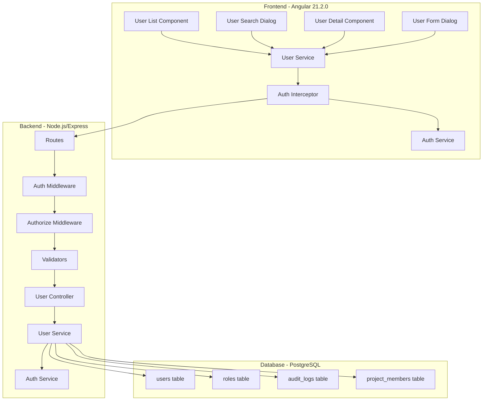
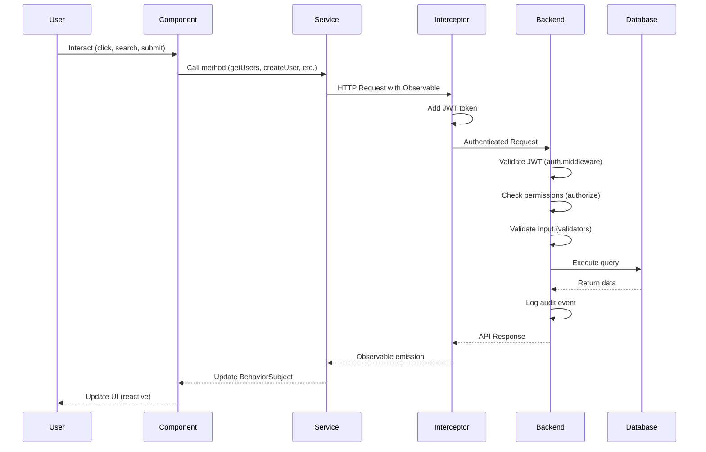

# Design Document: User/Member Management Module

## Overview

The User/Member Management module provides comprehensive system-level user administration capabilities for the Ramiscope Project Management System. This module enables administrators to view, search, create, edit, and manage user accounts across the system using a modern, reactive architecture built with Angular 21.2.0 standalone components and a RESTful Node.js/Express backend.

### Purpose

This module serves two primary purposes:
1. **System Administration**: Enable superadmins and admins to manage user accounts, roles, and access control
2. **Project Member Selection**: Provide user search and listing functionality for project managers to add members to projects

### Key Features

- **User List Management**: Paginated, filterable, sortable user lists with Material Design table
- **User Search**: Fast autocomplete search across username, email, and name fields
- **User Profile Management**: View detailed user profiles with project memberships
- **User Account Operations**: Create, update, deactivate, and reactivate user accounts
- **Role-Based Access Control**: Granular permissions based on user roles (superadmin, admin, manager, developer, viewer)
- **Audit Logging**: Complete audit trail for all user management actions
- **Modern Reactive UI**: Signal-based reactivity with RxJS and standalone Angular components

### Architecture Principles

1. **Separation of Concerns**: Clear separation between presentation (Angular), business logic (Express services), and data (PostgreSQL)
2. **Reactive Programming**: Observable-based data flow with BehaviorSubject state management
3. **Type Safety**: Full TypeScript typing across frontend with interface definitions
4. **Security First**: JWT authentication, role-based authorization, SQL injection prevention, password hashing
5. **Performance**: Database indexing, pagination, debounced search, lazy loading
6. **Maintainability**: Standalone components, dependency injection with inject(), consistent patterns

## Architecture

### High-Level System Architecture




### Component Interaction Flow



### Data Flow Architecture

**Request Flow:**
1. User interacts with Angular component
2. Component calls User Service method
3. Service creates HTTP Observable
4. Auth Interceptor adds JWT token to headers
5. Backend auth middleware validates token
6. Backend authorize middleware checks role permissions
7. Validators validate request data
8. Controller delegates to service layer
9. Service executes business logic and database queries
10. Audit log entry created
11. Response sent back through chain
12. Service updates BehaviorSubject state
13. Component reactively updates UI

**State Management Flow:**
- User Service maintains BehaviorSubject for user list state
- Components subscribe to observables using takeUntil pattern
- State updates trigger reactive UI changes
- Proper cleanup on component destroy

## Components and Interfaces

### Backend Components

#### 1. User Controller (`src/controllers/user.controller.js`)

**Responsibilities:**
- Handle HTTP requests for user management endpoints
- Delegate business logic to User Service
- Return standardized API responses
- Handle errors and edge cases

**Methods:**
```javascript
// GET /api/v1/users - List users with pagination and filters
getUsers(req, res, next)

// GET /api/v1/users/search - Search users by query
searchUsers(req, res, next)

// GET /api/v1/users/:id - Get user details by ID
getUserById(req, res, next)

// GET /api/v1/users/available/:projectId - Get users not in project
getAvailableUsers(req, res, next)

// POST /api/v1/users - Create new user
createUser(req, res, next)

// PUT /api/v1/users/:id - Update user information
updateUser(req, res, next)

// PATCH /api/v1/users/:id/deactivate - Deactivate user account
deactivateUser(req, res, next)

// PATCH /api/v1/users/:id/activate - Reactivate user account
activateUser(req, res, next)
```

#### 2. User Service (`src/services/user.service.js`)

**Responsibilities:**
- Implement business logic for user management
- Execute database queries with parameterized statements
- Integrate with Auth Service for audit logging
- Handle data transformation and validation

**Methods:**
```javascript
// Get paginated user list with filters
getUsers(page, limit, filters)

// Search users by query string
searchUsers(query, limit)

// Get user details with project memberships
getUserById(userId)

// Get users not in specified project
getAvailableUsersForProject(projectId)

// Create new user account
createUser(userData)

// Update user information
updateUser(userId, updateData)

// Deactivate user account (soft delete)
deactivateUser(userId, performingUserId)

// Reactivate user account
activateUser(userId, performingUserId)

// Check if user can perform action
canPerformAction(performingUserId, targetUserId, action)
```

#### 3. User Validators (`src/validators/user.validator.js`)

**Responsibilities:**
- Validate request data using express-validator
- Ensure data integrity before processing
- Return descriptive validation errors

**Validation Rules:**
```javascript
// Validate user creation data
validateCreateUser()

// Validate user update data
validateUpdateUser()

// Validate user ID parameter
validateUserId()

// Validate pagination parameters
validatePagination()

// Validate search query
validateSearchQuery()

// Validate project ID parameter
validateProjectId()
```

#### 4. Auth Middleware (`src/middleware/auth.middleware.js`)

**Existing middleware - will be reused:**
- `authenticate`: Verify JWT token and attach user to request
- `authorize(roles)`: Check if user has required role
- `optionalAuth`: Optional authentication for public endpoints

### Frontend Components

#### 1. User Service (`src/app/core/services/user.service.ts`)

**Responsibilities:**
- Centralize all user-related API calls
- Manage user list state with BehaviorSubject
- Handle HTTP errors consistently
- Provide Observable streams for reactive components

**Implementation:**
```typescript
@Injectable({ providedIn: 'root' })
export class UserService {
  private http = inject(HttpClient);
  private authService = inject(AuthService);
  
  // State management
  private usersSubject = new BehaviorSubject<User[]>([]);
  public users$ = this.usersSubject.asObservable();
  
  private loadingSubject = new BehaviorSubject<boolean>(false);
  public loading$ = this.loadingSubject.asObservable();
  
  // API methods
  getUsers(params: UserListParams): Observable<UserListResponse>
  searchUsers(query: string): Observable<User[]>
  getUserById(id: string): Observable<UserDetail>
  getAvailableUsers(projectId: string): Observable<User[]>
  createUser(userData: CreateUserRequest): Observable<User>
  updateUser(id: string, userData: UpdateUserRequest): Observable<User>
  deactivateUser(id: string): Observable<User>
  activateUser(id: string): Observable<User>
}
```

#### 2. User List Component (`src/app/features/users/user-list/user-list.component.ts`)

**Responsibilities:**
- Display users in Material table with pagination
- Provide search and filter controls
- Handle user actions (view, edit, deactivate)
- Navigate to user detail view

**Key Features:**
- Standalone component with Material imports
- inject() for dependency injection
- BehaviorSubject for local state
- takeUntil pattern for subscription cleanup
- Reactive forms for search and filters
- MatPaginator for pagination
- MatSort for column sorting

**Template Features:**
- Material table with columns: name, email, username, role, status, actions
- Search input with debounce (300ms)
- Filter dropdowns for role and active status
- Action buttons: view, edit, deactivate/activate
- Loading spinner overlay
- Empty state message
- Error handling with retry option

#### 3. User Search Dialog (`src/app/features/users/user-search-dialog/user-search-dialog.component.ts`)

**Responsibilities:**
- Provide autocomplete search interface
- Display search results in dropdown
- Emit selected user to parent component
- Handle keyboard navigation

**Key Features:**
- Standalone dialog component
- MatAutocomplete for search dropdown
- Debounced search (300ms)
- Keyboard navigation support
- Loading indicator
- No results message
- Error handling

#### 4. User Detail Component (`src/app/features/users/user-detail/user-detail.component.ts`)

**Responsibilities:**
- Display complete user profile
- Show project memberships
- Provide edit and deactivate actions
- Handle navigation and dialogs

**Key Features:**
- Standalone component
- Route parameter for user ID
- Display user information in cards
- List project memberships with roles
- Action buttons based on permissions
- Confirmation dialog for deactivation
- Loading and error states

#### 5. User Form Dialog (`src/app/features/users/user-form-dialog/user-form-dialog.component.ts`)

**Responsibilities:**
- Create and edit user accounts
- Validate form inputs in real-time
- Display validation errors
- Handle form submission

**Key Features:**
- Standalone dialog component
- Reactive forms with FormBuilder
- Real-time validation
- Password strength indicator
- Role dropdown
- Conditional fields (create vs edit mode)
- Loading state on submit
- Error handling

## Data Models

### Backend Data Models

#### Database Schema (Existing - No Changes Required)

**users table:**
```sql
CREATE TABLE users (
    id UUID PRIMARY KEY DEFAULT uuid_generate_v4(),
    email VARCHAR(255) UNIQUE NOT NULL,
    username VARCHAR(100) UNIQUE NOT NULL,
    password_hash VARCHAR(255) NOT NULL,
    first_name VARCHAR(100),
    last_name VARCHAR(100),
    role_id UUID REFERENCES roles(id) ON DELETE SET NULL,
    is_active BOOLEAN DEFAULT true,
    is_verified BOOLEAN DEFAULT false,
    last_login TIMESTAMP WITH TIME ZONE,
    created_at TIMESTAMP WITH TIME ZONE DEFAULT CURRENT_TIMESTAMP,
    updated_at TIMESTAMP WITH TIME ZONE DEFAULT CURRENT_TIMESTAMP
);

-- Indexes for performance
CREATE INDEX idx_users_email ON users(email);
CREATE INDEX idx_users_username ON users(username);
CREATE INDEX idx_users_role_id ON users(role_id);
CREATE INDEX idx_users_is_active ON users(is_active);
```

**roles table:**
```sql
CREATE TABLE roles (
    id UUID PRIMARY KEY DEFAULT uuid_generate_v4(),
    name VARCHAR(50) UNIQUE NOT NULL,
    description TEXT,
    created_at TIMESTAMP WITH TIME ZONE DEFAULT CURRENT_TIMESTAMP,
    updated_at TIMESTAMP WITH TIME ZONE DEFAULT CURRENT_TIMESTAMP
);

-- Default roles
INSERT INTO roles (name, description) VALUES
    ('superadmin', 'Super administrator with complete system control'),
    ('admin', 'System administrator with full access to manage users and projects'),
    ('manager', 'Project manager with team management capabilities'),
    ('developer', 'Developer with project access and task management'),
    ('viewer', 'Read-only access to assigned projects');
```

**audit_logs table:**
```sql
CREATE TABLE audit_logs (
    id UUID PRIMARY KEY DEFAULT uuid_generate_v4(),
    user_id UUID REFERENCES users(id) ON DELETE SET NULL,
    action VARCHAR(100) NOT NULL,
    resource VARCHAR(100),
    ip_address INET,
    user_agent TEXT,
    status VARCHAR(20),
    details JSONB,
    created_at TIMESTAMP WITH TIME ZONE DEFAULT CURRENT_TIMESTAMP
);

-- Indexes for audit queries
CREATE INDEX idx_audit_logs_user_id ON audit_logs(user_id);
CREATE INDEX idx_audit_logs_action ON audit_logs(action);
CREATE INDEX idx_audit_logs_created_at ON audit_logs(created_at);
```

#### Database Views

**user_details view:**
```sql
CREATE OR REPLACE VIEW user_details AS
SELECT 
    u.id,
    u.email,
    u.username,
    u.first_name,
    u.last_name,
    u.is_active,
    u.is_verified,
    u.last_login,
    u.created_at,
    u.updated_at,
    r.name as role_name,
    r.description as role_description
FROM users u
LEFT JOIN roles r ON u.role_id = r.id;
```

**user_project_memberships view:**
```sql
CREATE OR REPLACE VIEW user_project_memberships AS
SELECT 
    pm.user_id,
    pm.project_id,
    p.name as project_name,
    pm.role as project_role,
    pm.joined_at
FROM project_members pm
INNER JOIN projects p ON pm.project_id = p.id
WHERE p.is_active = true;
```

### Frontend Data Models

#### Core Models (`src/app/core/models/user.model.ts`)

```typescript
/**
 * User interface - basic user information
 */
export interface User {
  id: string;
  email: string;
  username: string;
  firstName?: string;
  lastName?: string;
  role?: string;
  isActive?: boolean;
  isVerified?: boolean;
  lastLogin?: string;
  createdAt?: string;
}

/**
 * User detail interface - extended user information
 */
export interface UserDetail extends User {
  updatedAt?: string;
  roleDescription?: string;
  projectMemberships?: ProjectMembership[];
}

/**
 * Project membership interface
 */
export interface ProjectMembership {
  projectId: string;
  projectName: string;
  projectRole: string;
  joinedAt: string;
}

/**
 * User list request parameters
 */
export interface UserListParams {
  page?: number;
  limit?: number;
  role?: string;
  isActive?: boolean;
  isVerified?: boolean;
  search?: string;
  sortBy?: string;
  sortOrder?: 'asc' | 'desc';
}

/**
 * User list response
 */
export interface UserListResponse {
  users: User[];
  pagination: PaginationMeta;
}

/**
 * Pagination metadata
 */
export interface PaginationMeta {
  currentPage: number;
  itemsPerPage: number;
  totalItems: number;
  totalPages: number;
}

/**
 * Create user request
 */
export interface CreateUserRequest {
  email: string;
  username: string;
  password: string;
  firstName?: string;
  lastName?: string;
  role: string;
}

/**
 * Update user request
 */
export interface UpdateUserRequest {
  firstName?: string;
  lastName?: string;
  role?: string;
  isActive?: boolean;
}

/**
 * User search result
 */
export interface UserSearchResult {
  id: string;
  username: string;
  email: string;
  firstName?: string;
  lastName?: string;
  role?: string;
  isActive: boolean;
}
```

## Backend API Design

### API Endpoints

#### 1. List Users

**Endpoint:** `GET /api/v1/users`

**Authentication:** Required (JWT)

**Authorization:** superadmin, admin, manager

**Query Parameters:**
```typescript
{
  page?: number;          // Page number (default: 1)
  limit?: number;         // Items per page (default: 20, max: 100)
  role?: string;          // Filter by role name
  isActive?: boolean;     // Filter by active status
  isVerified?: boolean;   // Filter by verified status
  search?: string;        // Search across username, email, name
  sortBy?: string;        // Sort column (default: created_at)
  sortOrder?: 'asc'|'desc'; // Sort direction (default: desc)
}
```

**Response:**
```json
{
  "success": true,
  "message": "Users retrieved successfully",
  "data": {
    "users": [
      {
        "id": "uuid",
        "email": "user@example.com",
        "username": "username",
        "firstName": "John",
        "lastName": "Doe",
        "role": "developer",
        "isActive": true,
        "isVerified": true,
        "lastLogin": "2024-01-15T10:30:00Z",
        "createdAt": "2024-01-01T00:00:00Z"
      }
    ],
    "pagination": {
      "currentPage": 1,
      "itemsPerPage": 20,
      "totalItems": 45,
      "totalPages": 3
    }
  },
  "timestamp": "2024-01-15T12:00:00Z"
}
```

**Error Responses:**
- `401 Unauthorized`: Missing or invalid JWT token
- `403 Forbidden`: Insufficient permissions
- `400 Bad Request`: Invalid query parameters
- `500 Internal Server Error`: Server error

**Performance:** < 500ms for up to 100 users

#### 2. Search Users

**Endpoint:** `GET /api/v1/users/search`

**Authentication:** Required (JWT)

**Authorization:** superadmin, admin, manager

**Query Parameters:**
```typescript
{
  q: string;              // Search query (min 2 characters)
  limit?: number;         // Max results (default: 20)
  excludeInactive?: boolean; // Exclude deactivated users (default: true)
}
```

**Response:**
```json
{
  "success": true,
  "message": "Search completed successfully",
  "data": {
    "users": [
      {
        "id": "uuid",
        "username": "johndoe",
        "email": "john@example.com",
        "firstName": "John",
        "lastName": "Doe",
        "role": "developer",
        "isActive": true
      }
    ]
  },
  "timestamp": "2024-01-15T12:00:00Z"
}
```

**Error Responses:**
- `400 Bad Request`: Query too short (< 2 characters)
- `401 Unauthorized`: Missing or invalid JWT token
- `403 Forbidden`: Insufficient permissions

**Performance:** < 300ms

#### 3. Get User Details

**Endpoint:** `GET /api/v1/users/:id`

**Authentication:** Required (JWT)

**Authorization:** 
- superadmin, admin: any user
- manager: any user (read-only)
- Any user: their own profile

**Path Parameters:**
- `id`: User UUID

**Response:**
```json
{
  "success": true,
  "message": "User details retrieved successfully",
  "data": {
    "user": {
      "id": "uuid",
      "email": "user@example.com",
      "username": "username",
      "firstName": "John",
      "lastName": "Doe",
      "role": "developer",
      "roleDescription": "Developer with project access",
      "isActive": true,
      "isVerified": true,
      "lastLogin": "2024-01-15T10:30:00Z",
      "createdAt": "2024-01-01T00:00:00Z",
      "updatedAt": "2024-01-10T15:00:00Z",
      "projectMemberships": [
        {
          "projectId": "uuid",
          "projectName": "Project Alpha",
          "projectRole": "developer",
          "joinedAt": "2024-01-05T00:00:00Z"
        }
      ]
    }
  },
  "timestamp": "2024-01-15T12:00:00Z"
}
```

**Error Responses:**
- `400 Bad Request`: Invalid user ID format
- `401 Unauthorized`: Missing or invalid JWT token
- `403 Forbidden`: Insufficient permissions
- `404 Not Found`: User not found

**Performance:** < 400ms

#### 4. Get Available Users for Project

**Endpoint:** `GET /api/v1/users/available/:projectId`

**Authentication:** Required (JWT)

**Authorization:** 
- superadmin, admin: any project
- manager: their own projects

**Path Parameters:**
- `projectId`: Project UUID

**Response:**
```json
{
  "success": true,
  "message": "Available users retrieved successfully",
  "data": {
    "users": [
      {
        "id": "uuid",
        "username": "johndoe",
        "email": "john@example.com",
        "firstName": "John",
        "lastName": "Doe",
        "role": "developer",
        "isActive": true
      }
    ]
  },
  "timestamp": "2024-01-15T12:00:00Z"
}
```

**Error Responses:**
- `400 Bad Request`: Invalid project ID format
- `401 Unauthorized`: Missing or invalid JWT token
- `403 Forbidden`: Insufficient permissions
- `404 Not Found`: Project not found

**Performance:** < 500ms

#### 5. Create User

**Endpoint:** `POST /api/v1/users`

**Authentication:** Required (JWT)

**Authorization:** superadmin, admin

**Request Body:**
```json
{
  "email": "newuser@example.com",
  "username": "newuser",
  "password": "SecurePass123!",
  "firstName": "New",
  "lastName": "User",
  "role": "developer"
}
```

**Validation Rules:**
- `email`: Required, valid email format (RFC 5322)
- `username`: Required, 3-100 characters, alphanumeric with dots, underscores, hyphens
- `password`: Required, min 8 characters, 1 uppercase, 1 lowercase, 1 number, 1 special char
- `firstName`: Optional, max 100 characters
- `lastName`: Optional, max 100 characters
- `role`: Required, valid role name (superadmin, admin, manager, developer, viewer)

**Response:**
```json
{
  "success": true,
  "message": "User created successfully",
  "data": {
    "user": {
      "id": "uuid",
      "email": "newuser@example.com",
      "username": "newuser",
      "firstName": "New",
      "lastName": "User",
      "role": "developer",
      "isActive": true,
      "isVerified": false,
      "createdAt": "2024-01-15T12:00:00Z"
    }
  },
  "timestamp": "2024-01-15T12:00:00Z"
}
```

**Error Responses:**
- `400 Bad Request`: Validation errors
- `401 Unauthorized`: Missing or invalid JWT token
- `403 Forbidden`: Insufficient permissions
- `409 Conflict`: Email or username already exists

**Performance:** < 1000ms (includes bcrypt hashing)

#### 6. Update User

**Endpoint:** `PUT /api/v1/users/:id`

**Authentication:** Required (JWT)

**Authorization:** 
- superadmin, admin: any user (all fields)
- Any user: their own profile (firstName, lastName only)

**Path Parameters:**
- `id`: User UUID

**Request Body:**
```json
{
  "firstName": "Updated",
  "lastName": "Name",
  "role": "manager",
  "isActive": true
}
```

**Validation Rules:**
- `firstName`: Optional, max 100 characters
- `lastName`: Optional, max 100 characters
- `role`: Optional, valid role name (admin only)
- `isActive`: Optional, boolean (admin only)
- `email`, `username`: Ignored (immutable)

**Response:**
```json
{
  "success": true,
  "message": "User updated successfully",
  "data": {
    "user": {
      "id": "uuid",
      "email": "user@example.com",
      "username": "username",
      "firstName": "Updated",
      "lastName": "Name",
      "role": "manager",
      "isActive": true,
      "updatedAt": "2024-01-15T12:00:00Z"
    }
  },
  "timestamp": "2024-01-15T12:00:00Z"
}
```

**Error Responses:**
- `400 Bad Request`: Validation errors or invalid user ID
- `401 Unauthorized`: Missing or invalid JWT token
- `403 Forbidden`: Insufficient permissions
- `404 Not Found`: User not found

**Performance:** < 500ms

#### 7. Deactivate User

**Endpoint:** `PATCH /api/v1/users/:id/deactivate`

**Authentication:** Required (JWT)

**Authorization:** superadmin only

**Path Parameters:**
- `id`: User UUID

**Request Body:** None

**Response:**
```json
{
  "success": true,
  "message": "User deactivated successfully",
  "data": {
    "user": {
      "id": "uuid",
      "email": "user@example.com",
      "username": "username",
      "isActive": false,
      "updatedAt": "2024-01-15T12:00:00Z"
    }
  },
  "timestamp": "2024-01-15T12:00:00Z"
}
```

**Error Responses:**
- `400 Bad Request`: Cannot deactivate self or last superadmin
- `401 Unauthorized`: Missing or invalid JWT token
- `403 Forbidden`: Insufficient permissions
- `404 Not Found`: User not found

**Performance:** < 500ms

#### 8. Activate User

**Endpoint:** `PATCH /api/v1/users/:id/activate`

**Authentication:** Required (JWT)

**Authorization:** superadmin, admin

**Path Parameters:**
- `id`: User UUID

**Request Body:** None

**Response:**
```json
{
  "success": true,
  "message": "User activated successfully",
  "data": {
    "user": {
      "id": "uuid",
      "email": "user@example.com",
      "username": "username",
      "isActive": true,
      "updatedAt": "2024-01-15T12:00:00Z"
    }
  },
  "timestamp": "2024-01-15T12:00:00Z"
}
```

**Error Responses:**
- `400 Bad Request`: Invalid user ID
- `401 Unauthorized`: Missing or invalid JWT token
- `403 Forbidden`: Insufficient permissions
- `404 Not Found`: User not found

**Performance:** < 500ms

### API Request/Response Patterns

All API responses follow the standardized `ApiResponse<T>` format:

```typescript
interface ApiResponse<T> {
  success: boolean;
  message: string;
  data?: T;
  errors?: ApiError[];
  timestamp: string;
}

interface ApiError {
  field?: string;
  message: string;
}
```

### Error Handling Strategy

**Validation Errors (400):**
```json
{
  "success": false,
  "message": "Validation failed",
  "errors": [
    {
      "field": "email",
      "message": "Invalid email format"
    },
    {
      "field": "password",
      "message": "Password must be at least 8 characters"
    }
  ],
  "timestamp": "2024-01-15T12:00:00Z"
}
```

**Authentication Errors (401):**
```json
{
  "success": false,
  "message": "Invalid or expired token",
  "timestamp": "2024-01-15T12:00:00Z"
}
```

**Authorization Errors (403):**
```json
{
  "success": false,
  "message": "Insufficient permissions",
  "timestamp": "2024-01-15T12:00:00Z"
}
```

**Not Found Errors (404):**
```json
{
  "success": false,
  "message": "User not found",
  "timestamp": "2024-01-15T12:00:00Z"
}
```

**Conflict Errors (409):**
```json
{
  "success": false,
  "message": "User with this email already exists",
  "timestamp": "2024-01-15T12:00:00Z"
}
```

**Server Errors (500):**
```json
{
  "success": false,
  "message": "Internal server error",
  "timestamp": "2024-01-15T12:00:00Z"
}
```


## Frontend Architecture

### Modern Angular Patterns (Angular 21.2.0)

#### Standalone Components

All components use the standalone pattern without NgModules:

```typescript
@Component({
  selector: 'app-user-list',
  standalone: true,
  imports: [
    CommonModule,
    RouterModule,
    ReactiveFormsModule,
    MatTableModule,
    MatPaginatorModule,
    MatSortModule,
    MatInputModule,
    MatButtonModule,
    MatIconModule,
    MatSelectModule,
    MatProgressSpinnerModule,
    MatDialogModule,
    MatTooltipModule
  ],
  templateUrl: './user-list.component.html',
  styleUrls: ['./user-list.component.scss']
})
export class UserListComponent implements OnInit, OnDestroy {
  // Component implementation
}
```

#### Dependency Injection with inject()

Use the inject() function instead of constructor injection:

```typescript
export class UserListComponent implements OnInit, OnDestroy {
  // Modern inject() pattern
  private userService = inject(UserService);
  private authService = inject(AuthService);
  private router = inject(Router);
  private dialog = inject(MatDialog);
  private snackBar = inject(MatSnackBar);
  
  // No constructor needed for DI
}
```

#### State Management with BehaviorSubject

```typescript
@Injectable({ providedIn: 'root' })
export class UserService {
  private http = inject(HttpClient);
  
  // State management
  private usersSubject = new BehaviorSubject<User[]>([]);
  public users$ = this.usersSubject.asObservable();
  
  private loadingSubject = new BehaviorSubject<boolean>(false);
  public loading$ = this.loadingSubject.asObservable();
  
  private errorSubject = new BehaviorSubject<string | null>(null);
  public error$ = this.errorSubject.asObservable();
  
  // Methods update subjects
  getUsers(params: UserListParams): Observable<UserListResponse> {
    this.loadingSubject.next(true);
    this.errorSubject.next(null);
    
    return this.http.get<ApiResponse<UserListResponse>>(
      `${environment.apiUrl}/users`,
      { params: this.buildParams(params) }
    ).pipe(
      map(response => response.data!),
      tap(data => {
        this.usersSubject.next(data.users);
        this.loadingSubject.next(false);
      }),
      catchError(error => {
        this.loadingSubject.next(false);
        this.errorSubject.next(this.handleError(error));
        return throwError(() => error);
      })
    );
  }
}
```

#### Subscription Management with takeUntil

```typescript
export class UserListComponent implements OnInit, OnDestroy {
  private destroy$ = new Subject<void>();
  
  ngOnInit(): void {
    // Subscribe with automatic cleanup
    this.userService.users$
      .pipe(takeUntil(this.destroy$))
      .subscribe(users => {
        this.dataSource.data = users;
      });
    
    this.userService.loading$
      .pipe(takeUntil(this.destroy$))
      .subscribe(loading => {
        this.isLoading = loading;
      });
  }
  
  ngOnDestroy(): void {
    this.destroy$.next();
    this.destroy$.complete();
  }
}
```

#### Reactive Forms

```typescript
export class UserFormDialogComponent implements OnInit {
  private fb = inject(FormBuilder);
  
  userForm = this.fb.group({
    email: ['', [Validators.required, Validators.email]],
    username: ['', [
      Validators.required,
      Validators.minLength(3),
      Validators.maxLength(100),
      Validators.pattern(/^[a-zA-Z0-9._-]+$/)
    ]],
    password: ['', [
      Validators.required,
      Validators.minLength(8),
      this.passwordStrengthValidator()
    ]],
    firstName: ['', [Validators.maxLength(100)]],
    lastName: ['', [Validators.maxLength(100)]],
    role: ['developer', [Validators.required]]
  });
  
  ngOnInit(): void {
    // Watch for form changes
    this.userForm.valueChanges
      .pipe(
        debounceTime(300),
        takeUntil(this.destroy$)
      )
      .subscribe(() => {
        this.updatePasswordStrength();
      });
  }
}
```

### Component Specifications

#### 1. User List Component

**File:** `src/app/features/users/user-list/user-list.component.ts`

**Responsibilities:**
- Display users in Material table
- Provide pagination, sorting, filtering
- Handle user actions (view, edit, deactivate)
- Navigate to detail view

**State:**
```typescript
// Local state
dataSource = new MatTableDataSource<User>([]);
displayedColumns = ['name', 'email', 'username', 'role', 'status', 'actions'];
isLoading = false;
error: string | null = null;

// Pagination
@ViewChild(MatPaginator) paginator!: MatPaginator;
pageSize = 20;
pageSizeOptions = [10, 20, 50, 100];
totalItems = 0;

// Sorting
@ViewChild(MatSort) sort!: MatSort;

// Filters
filterForm = this.fb.group({
  search: [''],
  role: [''],
  isActive: ['']
});
```

**Methods:**
```typescript
ngOnInit(): void
ngAfterViewInit(): void
loadUsers(): void
onPageChange(event: PageEvent): void
onSortChange(event: Sort): void
onFilterChange(): void
onSearchChange(query: string): void
openCreateDialog(): void
openEditDialog(user: User): void
viewUserDetail(userId: string): void
confirmDeactivate(user: User): void
deactivateUser(userId: string): void
activateUser(userId: string): void
```

**Template Features:**
- Material toolbar with title and "Add User" button
- Search input with mat-icon
- Filter dropdowns (role, active status)
- Material table with sorting
- Action column with icon buttons
- Material paginator
- Loading overlay with spinner
- Empty state message
- Error message with retry button

#### 2. User Search Dialog Component

**File:** `src/app/features/users/user-search-dialog/user-search-dialog.component.ts`

**Responsibilities:**
- Provide autocomplete search
- Display search results
- Emit selected user
- Handle keyboard navigation

**State:**
```typescript
searchControl = new FormControl('');
filteredUsers$!: Observable<UserSearchResult[]>;
isSearching = false;
```

**Methods:**
```typescript
ngOnInit(): void
setupAutocomplete(): void
onUserSelected(user: UserSearchResult): void
displayFn(user: UserSearchResult): string
onCancel(): void
```

**Template Features:**
- Material form field with autocomplete
- mat-option for each result
- User display with avatar, name, email, role
- Loading indicator
- No results message
- Keyboard navigation support

#### 3. User Detail Component

**File:** `src/app/features/users/user-detail/user-detail.component.ts`

**Responsibilities:**
- Display complete user profile
- Show project memberships
- Provide edit and deactivate actions
- Handle navigation

**State:**
```typescript
userId!: string;
user: UserDetail | null = null;
isLoading = false;
error: string | null = null;
canEdit = false;
canDeactivate = false;
```

**Methods:**
```typescript
ngOnInit(): void
loadUserDetail(): void
openEditDialog(): void
confirmDeactivate(): void
deactivateUser(): void
activateUser(): void
navigateToProject(projectId: string): void
goBack(): void
```

**Template Features:**
- Material card for user profile
- User avatar with initials
- Profile information grid
- Role badge with color coding
- Status badge (active/inactive)
- Material card for project memberships
- List of projects with roles
- Action buttons (edit, deactivate/activate)
- Back button
- Loading spinner
- Error message

#### 4. User Form Dialog Component

**File:** `src/app/features/users/user-form-dialog/user-form-dialog.component.ts`

**Responsibilities:**
- Create and edit users
- Validate form inputs
- Display validation errors
- Handle submission

**State:**
```typescript
mode: 'create' | 'edit' = 'create';
userId?: string;
userForm!: FormGroup;
isSubmitting = false;
error: string | null = null;
passwordStrength: 'weak' | 'medium' | 'strong' = 'weak';
roles: string[] = ['superadmin', 'admin', 'manager', 'developer', 'viewer'];
```

**Methods:**
```typescript
ngOnInit(): void
initForm(): void
loadUserData(): void
updatePasswordStrength(): void
passwordStrengthValidator(): ValidatorFn
onSubmit(): void
onCancel(): void
getErrorMessage(field: string): string
```

**Template Features:**
- Material dialog with title
- Reactive form with mat-form-fields
- Email input with validation
- Username input with validation
- Password input with strength indicator (create mode only)
- First name and last name inputs
- Role dropdown
- Validation error messages
- Submit button (disabled when invalid)
- Cancel button
- Loading spinner on submit

### Service Implementation Details

#### User Service

**File:** `src/app/core/services/user.service.ts`

**Complete Implementation:**

```typescript
import { Injectable, inject } from '@angular/core';
import { HttpClient, HttpParams } from '@angular/common/http';
import { BehaviorSubject, Observable, throwError } from 'rxjs';
import { map, tap, catchError } from 'rxjs/operators';

import { environment } from '../../../environments/environment';
import {
  User,
  UserDetail,
  UserListParams,
  UserListResponse,
  CreateUserRequest,
  UpdateUserRequest,
  UserSearchResult
} from '../models/user.model';
import { ApiResponse } from '../models/api-response.model';

@Injectable({
  providedIn: 'root'
})
export class UserService {
  private http = inject(HttpClient);
  
  // State management
  private usersSubject = new BehaviorSubject<User[]>([]);
  public users$ = this.usersSubject.asObservable();
  
  private loadingSubject = new BehaviorSubject<boolean>(false);
  public loading$ = this.loadingSubject.asObservable();
  
  private errorSubject = new BehaviorSubject<string | null>(null);
  public error$ = this.errorSubject.asObservable();
  
  /**
   * Get paginated user list with filters
   */
  getUsers(params: UserListParams): Observable<UserListResponse> {
    this.loadingSubject.next(true);
    this.errorSubject.next(null);
    
    const httpParams = this.buildParams(params);
    
    return this.http.get<ApiResponse<UserListResponse>>(
      `${environment.apiUrl}/users`,
      { params: httpParams }
    ).pipe(
      map(response => response.data!),
      tap(data => {
        this.usersSubject.next(data.users);
        this.loadingSubject.next(false);
      }),
      catchError(error => {
        this.loadingSubject.next(false);
        const errorMessage = this.extractErrorMessage(error);
        this.errorSubject.next(errorMessage);
        return throwError(() => new Error(errorMessage));
      })
    );
  }
  
  /**
   * Search users by query
   */
  searchUsers(query: string): Observable<UserSearchResult[]> {
    if (query.length < 2) {
      return throwError(() => new Error('Search query must be at least 2 characters'));
    }
    
    const params = new HttpParams()
      .set('q', query)
      .set('limit', '20');
    
    return this.http.get<ApiResponse<{ users: UserSearchResult[] }>>(
      `${environment.apiUrl}/users/search`,
      { params }
    ).pipe(
      map(response => response.data!.users),
      catchError(error => {
        const errorMessage = this.extractErrorMessage(error);
        return throwError(() => new Error(errorMessage));
      })
    );
  }
  
  /**
   * Get user details by ID
   */
  getUserById(id: string): Observable<UserDetail> {
    return this.http.get<ApiResponse<{ user: UserDetail }>>(
      `${environment.apiUrl}/users/${id}`
    ).pipe(
      map(response => response.data!.user),
      catchError(error => {
        const errorMessage = this.extractErrorMessage(error);
        return throwError(() => new Error(errorMessage));
      })
    );
  }
  
  /**
   * Get users available for project (not already members)
   */
  getAvailableUsers(projectId: string): Observable<User[]> {
    return this.http.get<ApiResponse<{ users: User[] }>>(
      `${environment.apiUrl}/users/available/${projectId}`
    ).pipe(
      map(response => response.data!.users),
      catchError(error => {
        const errorMessage = this.extractErrorMessage(error);
        return throwError(() => new Error(errorMessage));
      })
    );
  }
  
  /**
   * Create new user
   */
  createUser(userData: CreateUserRequest): Observable<User> {
    return this.http.post<ApiResponse<{ user: User }>>(
      `${environment.apiUrl}/users`,
      userData
    ).pipe(
      map(response => response.data!.user),
      tap(() => {
        // Refresh user list after creation
        this.refreshUsers();
      }),
      catchError(error => {
        const errorMessage = this.extractErrorMessage(error);
        return throwError(() => new Error(errorMessage));
      })
    );
  }
  
  /**
   * Update user information
   */
  updateUser(id: string, userData: UpdateUserRequest): Observable<User> {
    return this.http.put<ApiResponse<{ user: User }>>(
      `${environment.apiUrl}/users/${id}`,
      userData
    ).pipe(
      map(response => response.data!.user),
      tap(() => {
        // Refresh user list after update
        this.refreshUsers();
      }),
      catchError(error => {
        const errorMessage = this.extractErrorMessage(error);
        return throwError(() => new Error(errorMessage));
      })
    );
  }
  
  /**
   * Deactivate user account
   */
  deactivateUser(id: string): Observable<User> {
    return this.http.patch<ApiResponse<{ user: User }>>(
      `${environment.apiUrl}/users/${id}/deactivate`,
      {}
    ).pipe(
      map(response => response.data!.user),
      tap(() => {
        // Refresh user list after deactivation
        this.refreshUsers();
      }),
      catchError(error => {
        const errorMessage = this.extractErrorMessage(error);
        return throwError(() => new Error(errorMessage));
      })
    );
  }
  
  /**
   * Activate user account
   */
  activateUser(id: string): Observable<User> {
    return this.http.patch<ApiResponse<{ user: User }>>(
      `${environment.apiUrl}/users/${id}/activate`,
      {}
    ).pipe(
      map(response => response.data!.user),
      tap(() => {
        // Refresh user list after activation
        this.refreshUsers();
      }),
      catchError(error => {
        const errorMessage = this.extractErrorMessage(error);
        return throwError(() => new Error(errorMessage));
      })
    );
  }
  
  /**
   * Build HTTP params from user list params
   */
  private buildParams(params: UserListParams): HttpParams {
    let httpParams = new HttpParams();
    
    if (params.page) {
      httpParams = httpParams.set('page', params.page.toString());
    }
    if (params.limit) {
      httpParams = httpParams.set('limit', params.limit.toString());
    }
    if (params.role) {
      httpParams = httpParams.set('role', params.role);
    }
    if (params.isActive !== undefined) {
      httpParams = httpParams.set('isActive', params.isActive.toString());
    }
    if (params.isVerified !== undefined) {
      httpParams = httpParams.set('isVerified', params.isVerified.toString());
    }
    if (params.search) {
      httpParams = httpParams.set('search', params.search);
    }
    if (params.sortBy) {
      httpParams = httpParams.set('sortBy', params.sortBy);
    }
    if (params.sortOrder) {
      httpParams = httpParams.set('sortOrder', params.sortOrder);
    }
    
    return httpParams;
  }
  
  /**
   * Extract error message from HTTP error
   */
  private extractErrorMessage(error: any): string {
    if (error.error?.message) {
      return error.error.message;
    }
    if (error.message) {
      return error.message;
    }
    if (error.status === 0) {
      return 'Cannot connect to server';
    }
    if (error.status === 401) {
      return 'Unauthorized access';
    }
    if (error.status === 403) {
      return 'Insufficient permissions';
    }
    if (error.status === 404) {
      return 'User not found';
    }
    return 'An error occurred';
  }
  
  /**
   * Refresh user list (called after mutations)
   */
  private refreshUsers(): void {
    // Trigger refresh by emitting current state
    // Components can re-fetch if needed
    this.errorSubject.next(null);
  }
}
```

### Routing Configuration

**File:** `src/app/app.routes.ts`

```typescript
import { Routes } from '@angular/router';
import { authGuard } from './core/guards/auth.guard';
import { roleGuard } from './core/guards/role.guard';

export const routes: Routes = [
  // ... existing routes
  {
    path: 'users',
    canActivate: [authGuard, roleGuard],
    data: { roles: ['superadmin', 'admin', 'manager'] },
    children: [
      {
        path: '',
        loadComponent: () => 
          import('./features/users/user-list/user-list.component')
            .then(m => m.UserListComponent)
      },
      {
        path: ':id',
        loadComponent: () => 
          import('./features/users/user-detail/user-detail.component')
            .then(m => m.UserDetailComponent)
      }
    ]
  }
];
```

### Material Theme Integration

**File:** `src/styles.scss`

```scss
// User management specific styles
.user-avatar {
  width: 40px;
  height: 40px;
  border-radius: 50%;
  display: flex;
  align-items: center;
  justify-content: center;
  font-weight: 600;
  color: white;
  background: linear-gradient(135deg, #667eea 0%, #764ba2 100%);
}

.role-badge {
  padding: 4px 12px;
  border-radius: 12px;
  font-size: 12px;
  font-weight: 500;
  
  &.role-superadmin {
    background-color: #ef4444;
    color: white;
  }
  
  &.role-admin {
    background-color: #f59e0b;
    color: white;
  }
  
  &.role-manager {
    background-color: #3b82f6;
    color: white;
  }
  
  &.role-developer {
    background-color: #10b981;
    color: white;
  }
  
  &.role-viewer {
    background-color: #6b7280;
    color: white;
  }
}

.status-badge {
  padding: 4px 12px;
  border-radius: 12px;
  font-size: 12px;
  font-weight: 500;
  
  &.status-active {
    background-color: #d1fae5;
    color: #065f46;
  }
  
  &.status-inactive {
    background-color: #fee2e2;
    color: #991b1b;
  }
}

.password-strength {
  height: 4px;
  border-radius: 2px;
  margin-top: 8px;
  transition: all 0.3s ease;
  
  &.weak {
    width: 33%;
    background-color: #ef4444;
  }
  
  &.medium {
    width: 66%;
    background-color: #f59e0b;
  }
  
  &.strong {
    width: 100%;
    background-color: #10b981;
  }
}
```

## Security Considerations

### Authentication and Authorization

#### JWT Token Management

**Token Flow:**
1. User logs in → receives access token (15 min) and refresh token (7 days)
2. Access token stored in localStorage (or sessionStorage)
3. Auth interceptor adds token to all API requests
4. Backend validates token on each request
5. Token refresh triggered automatically before expiration

**Implementation:**
- Auth interceptor adds `Authorization: Bearer <token>` header
- Backend auth middleware validates JWT signature and expiration
- Backend authorize middleware checks user role against required roles
- Refresh token rotation for enhanced security

#### Role-Based Access Control (RBAC)

**Role Hierarchy:**
```
superadmin > admin > manager > developer > viewer
```

**Permission Matrix:**

| Action | superadmin | admin | manager | developer | viewer |
|--------|-----------|-------|---------|-----------|--------|
| List users | ✓ | ✓ | ✓ | ✗ | ✗ |
| Search users | ✓ | ✓ | ✓ | ✗ | ✗ |
| View user details | ✓ | ✓ | ✓ | Own only | Own only |
| Create user | ✓ | ✓ | ✗ | ✗ | ✗ |
| Update user | ✓ | ✓ | ✗ | Own profile | ✗ |
| Deactivate user | ✓ | ✗ | ✗ | ✗ | ✗ |
| Activate user | ✓ | ✓ | ✗ | ✗ | ✗ |

**Implementation:**
```javascript
// Backend route protection
router.get('/users', 
  authenticate, 
  authorize(['superadmin', 'admin', 'manager']), 
  userController.getUsers
);

router.post('/users', 
  authenticate, 
  authorize(['superadmin', 'admin']), 
  validateCreateUser(), 
  userController.createUser
);

router.patch('/users/:id/deactivate', 
  authenticate, 
  authorize(['superadmin']), 
  validateUserId(), 
  userController.deactivateUser
);
```

### Input Validation and Sanitization

#### Backend Validation (express-validator)

**Email Validation:**
```javascript
body('email')
  .trim()
  .isEmail().withMessage('Invalid email format')
  .normalizeEmail()
  .custom(async (email) => {
    const existing = await query('SELECT id FROM users WHERE email = $1', [email]);
    if (existing.rows.length > 0) {
      throw new Error('Email already exists');
    }
  })
```

**Username Validation:**
```javascript
body('username')
  .trim()
  .isLength({ min: 3, max: 100 }).withMessage('Username must be 3-100 characters')
  .matches(/^[a-zA-Z0-9._-]+$/).withMessage('Username can only contain letters, numbers, dots, underscores, and hyphens')
  .custom(async (username) => {
    const existing = await query('SELECT id FROM users WHERE username = $1', [username]);
    if (existing.rows.length > 0) {
      throw new Error('Username already exists');
    }
  })
```

**Password Validation:**
```javascript
body('password')
  .isLength({ min: 8 }).withMessage('Password must be at least 8 characters')
  .matches(/[A-Z]/).withMessage('Password must contain at least one uppercase letter')
  .matches(/[a-z]/).withMessage('Password must contain at least one lowercase letter')
  .matches(/[0-9]/).withMessage('Password must contain at least one number')
  .matches(/[!@#$%^&*(),.?":{}|<>]/).withMessage('Password must contain at least one special character')
```

#### Frontend Validation (Angular Reactive Forms)

**Custom Validators:**
```typescript
// Password strength validator
passwordStrengthValidator(): ValidatorFn {
  return (control: AbstractControl): ValidationErrors | null => {
    const value = control.value;
    if (!value) return null;
    
    const hasUpperCase = /[A-Z]/.test(value);
    const hasLowerCase = /[a-z]/.test(value);
    const hasNumeric = /[0-9]/.test(value);
    const hasSpecialChar = /[!@#$%^&*(),.?":{}|<>]/.test(value);
    const isLengthValid = value.length >= 8;
    
    const passwordValid = hasUpperCase && hasLowerCase && 
                         hasNumeric && hasSpecialChar && isLengthValid;
    
    return passwordValid ? null : { passwordStrength: true };
  };
}

// Username format validator
usernameFormatValidator(): ValidatorFn {
  return (control: AbstractControl): ValidationErrors | null => {
    const value = control.value;
    if (!value) return null;
    
    const isValid = /^[a-zA-Z0-9._-]+$/.test(value);
    return isValid ? null : { usernameFormat: true };
  };
}
```

### SQL Injection Prevention

**Parameterized Queries:**
```javascript
// GOOD - Parameterized query
const result = await query(
  'SELECT * FROM users WHERE email = $1 OR username = $1',
  [identifier]
);

// BAD - String concatenation (vulnerable to SQL injection)
const result = await query(
  `SELECT * FROM users WHERE email = '${identifier}' OR username = '${identifier}'`
);
```

**All database queries use parameterized statements with positional parameters ($1, $2, etc.)**

### Password Security

**Bcrypt Hashing:**
```javascript
const bcrypt = require('bcrypt');
const SALT_ROUNDS = 12;

// Hash password
const passwordHash = await bcrypt.hash(password, SALT_ROUNDS);

// Verify password
const isValid = await bcrypt.compare(password, passwordHash);
```

**Password Storage:**
- Never store plaintext passwords
- Use bcrypt with 12 salt rounds
- Password hashes stored in `password_hash` column
- Passwords never returned in API responses

### Audit Logging

**Audit Log Entry:**
```javascript
await query(
  `INSERT INTO audit_logs (user_id, action, resource, ip_address, user_agent, status, details)
   VALUES ($1, $2, $3, $4, $5, $6, $7)`,
  [
    performingUserId,
    'user_created',
    'users',
    req.ip,
    req.get('user-agent'),
    'success',
    JSON.stringify({ targetUserId, email, username, role })
  ]
);
```

**Logged Actions:**
- `user_created`: New user account created
- `user_updated`: User information modified
- `user_deactivated`: User account deactivated
- `user_activated`: User account reactivated
- `login_success`: Successful login
- `login_failed`: Failed login attempt

**Audit Log Retention:**
- Logs stored indefinitely for compliance
- Indexed by user_id, action, and created_at
- Queryable for security investigations

### XSS Prevention

**Frontend:**
- Angular's built-in sanitization for template bindings
- Use `[innerHTML]` with DomSanitizer for dynamic HTML
- Avoid `bypassSecurityTrust*` methods unless absolutely necessary

**Backend:**
- Content-Type headers set correctly
- No user input directly rendered in HTML responses
- API returns JSON only

### CSRF Protection

**Not Required for JWT-based API:**
- JWT tokens in Authorization header (not cookies)
- No session cookies used
- CORS configured to allow only trusted origins

### CORS Configuration

**Backend CORS Setup:**
```javascript
const cors = require('cors');

app.use(cors({
  origin: process.env.FRONTEND_URL || 'http://localhost:4200',
  credentials: true,
  methods: ['GET', 'POST', 'PUT', 'PATCH', 'DELETE'],
  allowedHeaders: ['Content-Type', 'Authorization']
}));
```


## Correctness Properties

*A property is a characteristic or behavior that should hold true across all valid executions of a system—essentially, a formal statement about what the system should do. Properties serve as the bridge between human-readable specifications and machine-verifiable correctness guarantees.*

### Property Reflection

After analyzing all acceptance criteria, I identified the following property consolidations to eliminate redundancy:

**Consolidated Properties:**
1. **Response Structure Properties**: Multiple criteria (1.8, 1.9, 2.7, 3.2, 3.3, 4.4) test that responses contain required fields. These can be consolidated into properties that verify response structure completeness.

2. **Filter Properties**: Criteria 1.5, 1.6, 1.7 all test filtering logic. These can be consolidated into a single property that verifies all returned items match all active filters.

3. **Pagination Properties**: Criteria 1.1, 1.2, 1.9 test pagination behavior. These can be consolidated into properties that verify pagination correctness.

4. **Audit Logging Properties**: Criteria 14.1-14.11 test audit logging. These can be consolidated into properties that verify audit log completeness and correctness.

5. **Immutability Properties**: Criteria 6.3, 6.4 test that email/username cannot be changed. These can be consolidated into a single property.

6. **Idempotence Properties**: Criteria 7.6, 8.4 test idempotence for deactivate/activate. These can be consolidated into properties for each operation.

7. **Authorization Properties**: Multiple criteria test role-based access. These are better tested as example-based tests rather than properties since they test specific role combinations.

**Properties to Exclude:**
- Performance requirements (1.11, 2.9, 3.8, 4.9, 5.20, 6.16, 7.13, 8.9, 14.12, 16.1-16.11): These are integration/performance tests, not functional properties
- Authorization examples (1.10, 3.5-3.7, 4.5-4.8, 5.18, 6.13-6.14, 7.10-7.11, 8.7, 15.1-15.11): These test specific role combinations, better as example-based tests
- Error examples (2.3, 2.10, 3.4, 4.5, 5.13, 6.10, 7.5, 8.3): These test specific error cases, better as example-based tests

### Property-Based Testing Properties

#### Property 1: Pagination Correctness

*For any* valid pagination parameters (page number and limit), the sum of returned user counts across all pages SHALL equal the total user count, and each page SHALL contain at most the specified limit of users.

**Validates: Requirements 1.1, 1.2, 1.9**

**Test Strategy**: Generate random pagination parameters, fetch all pages, verify sum equals total and each page respects limit.

#### Property 2: Filter Completeness

*For any* combination of filter parameters (role, isActive, isVerified), all returned users SHALL match all specified filter criteria.

**Validates: Requirements 1.5, 1.6, 1.7**

**Test Strategy**: Generate random filter combinations, verify every returned user matches all active filters.

#### Property 3: User List Response Structure

*For any* user returned by the list API, the response SHALL include all required fields: id, email, username, firstName, lastName, role, isActive, isVerified, and createdAt.

**Validates: Requirements 1.8**

**Test Strategy**: Generate random list requests, verify every user object has all required fields.

#### Property 4: Search Field Coverage

*For any* search query (minimum 2 characters), all returned users SHALL contain the search query as a case-insensitive substring in at least one of the searchable fields (username, email, firstName, lastName).

**Validates: Requirements 2.1, 2.4**

**Test Strategy**: Generate random search queries and user data, verify all results match query in at least one field.

#### Property 5: Search Result Limit

*For any* search query, the number of returned users SHALL be less than or equal to 20.

**Validates: Requirements 2.6**

**Test Strategy**: Generate search queries that match many users, verify result count ≤ 20.

#### Property 6: Search Active User Filter

*For any* search query with default parameters, all returned users SHALL have isActive = true.

**Validates: Requirements 2.8**

**Test Strategy**: Generate random search queries, verify all results are active users.

#### Property 7: User Detail Response Structure

*For any* valid user ID, the user detail response SHALL include all required fields: id, email, username, firstName, lastName, role, roleDescription, isActive, isVerified, lastLogin, createdAt, updatedAt, and projectMemberships array.

**Validates: Requirements 3.2, 3.3**

**Test Strategy**: Generate random valid user IDs, verify response structure completeness.

#### Property 8: Available Users Exclusion

*For any* valid project ID, all returned available users SHALL NOT exist in the project_members table for that project, and all SHALL have isActive = true.

**Validates: Requirements 4.1, 4.2, 4.3**

**Test Strategy**: Generate random projects with members, verify returned users are not in project_members and are active.

#### Property 9: User Creation Success

*For any* valid user creation request (valid email, username, password, role), a new user SHALL be created in the database with the specified attributes and default values (isActive = true, isVerified = false).

**Validates: Requirements 5.1, 5.14, 5.15**

**Test Strategy**: Generate random valid user data, verify user created with correct attributes.

#### Property 10: Password Hashing

*For any* created user, the stored password_hash SHALL NOT equal the plaintext password, and verifying the plaintext password against the hash SHALL return true.

**Validates: Requirements 5.11**

**Test Strategy**: Create users with random passwords, verify hash ≠ plaintext and bcrypt.compare succeeds.

#### Property 11: Email Uniqueness

*For any* existing user email, attempting to create a new user with the same email SHALL be rejected with a 409 Conflict error.

**Validates: Requirements 5.12, 5.13**

**Test Strategy**: Create user, attempt to create duplicate with same email, verify rejection.

#### Property 12: Username Uniqueness

*For any* existing user username, attempting to create a new user with the same username SHALL be rejected with a 409 Conflict error.

**Validates: Requirements 5.12, 5.13**

**Test Strategy**: Create user, attempt to create duplicate with same username, verify rejection.

#### Property 13: Password Exclusion from Response

*For any* user creation or update operation, the API response SHALL NOT contain the password_hash field.

**Validates: Requirements 5.17, 6.12**

**Test Strategy**: Create/update users, verify response does not include password_hash.

#### Property 14: Email and Username Immutability

*For any* user update request that includes email or username changes, those fields SHALL remain unchanged in the database after the update.

**Validates: Requirements 6.3, 6.4**

**Test Strategy**: Update user with email/username changes, verify those fields unchanged.

#### Property 15: Update Timestamp Increment

*For any* user update operation, the updated_at timestamp SHALL be greater than or equal to the previous updated_at value.

**Validates: Requirements 6.11**

**Test Strategy**: Update user, verify new updated_at ≥ old updated_at.

#### Property 16: Update Idempotence

*For any* update data, applying the same update twice SHALL produce the same final state as applying it once.

**Validates: Requirements 6.1**

**Test Strategy**: Apply same update twice, verify final state identical.

#### Property 17: Deactivation Soft Delete

*For any* user deactivation, all user data except is_active SHALL remain unchanged, and the user record SHALL still exist in the database.

**Validates: Requirements 7.2, 7.3**

**Test Strategy**: Deactivate user, verify all fields except is_active unchanged and record exists.

#### Property 18: Deactivation Idempotence

*For any* user, deactivating multiple times SHALL produce the same result as deactivating once (is_active = false).

**Validates: Requirements 7.6**

**Test Strategy**: Deactivate user multiple times, verify final state same as single deactivation.

#### Property 19: Deactivation Token Revocation

*For any* deactivated user, all active refresh tokens SHALL have revoked_at timestamp set.

**Validates: Requirements 7.7**

**Test Strategy**: Deactivate user with active tokens, verify all tokens have revoked_at set.

#### Property 20: Reactivation Idempotence

*For any* user, reactivating multiple times SHALL produce the same result as reactivating once (is_active = true).

**Validates: Requirements 8.4**

**Test Strategy**: Reactivate user multiple times, verify final state same as single reactivation.

#### Property 21: Deactivation-Reactivation Round Trip

*For any* user, deactivating then reactivating SHALL restore the is_active flag to true while preserving all other data.

**Validates: Requirements 7.1, 8.1**

**Test Strategy**: Deactivate then reactivate user, verify is_active = true and other data unchanged.

#### Property 22: Audit Log Creation

*For any* user management action (create, update, deactivate, activate), an audit log entry SHALL be created with action type, performing user ID, target user ID, IP address, user agent, timestamp, and status.

**Validates: Requirements 14.1, 14.2, 14.3, 14.4, 14.5, 14.6, 14.7, 14.8, 14.9, 14.10**

**Test Strategy**: Perform any user management action, verify audit_logs table has complete entry.

#### Property 23: Audit Log Error Details

*For any* failed user management action, the audit log entry SHALL include error details in the details field.

**Validates: Requirements 14.11**

**Test Strategy**: Trigger failed actions, verify audit_logs.details contains error information.

#### Property 24: Email Format Validation

*For any* user creation request with invalid email format, the API SHALL reject the request with a 400 Bad Request error.

**Validates: Requirements 5.4, 5.5**

**Test Strategy**: Generate random invalid email formats, verify all rejected with 400.

#### Property 25: Username Format Validation

*For any* user creation request with username containing invalid characters or invalid length, the API SHALL reject the request with a 400 Bad Request error.

**Validates: Requirements 5.6, 5.7, 5.8**

**Test Strategy**: Generate random invalid usernames, verify all rejected with 400.

#### Property 26: Password Strength Validation

*For any* user creation request with weak password (< 8 chars, missing uppercase, lowercase, number, or special char), the API SHALL reject the request with a 400 Bad Request error.

**Validates: Requirements 5.9, 5.10**

**Test Strategy**: Generate random weak passwords, verify all rejected with 400.

#### Property 27: Role Validation

*For any* user creation or update request with invalid role name, the API SHALL reject the request with a 400 Bad Request error.

**Validates: Requirements 5.16, 6.5, 6.6**

**Test Strategy**: Generate random invalid role names, verify all rejected with 400.

#### Property 28: Search Minimum Length Validation

*For any* search query with less than 2 characters, the API SHALL reject the request with a 400 Bad Request error.

**Validates: Requirements 2.2, 2.3**

**Test Strategy**: Generate 0-1 character queries, verify all rejected with 400.

#### Property 29: Pagination Limit Enforcement

*For any* list request with limit > 100, the API SHALL return at most 100 users.

**Validates: Requirements 1.3**

**Test Strategy**: Request with limit > 100, verify response contains ≤ 100 users.

#### Property 30: Search Relevance Ordering

*For any* search query, exact matches SHALL appear before partial matches in the results.

**Validates: Requirements 2.5**

**Test Strategy**: Generate search queries with exact and partial matches, verify ordering.

### Testing Strategy Notes

**Property-Based Test Configuration:**
- Minimum 100 iterations per property test
- Each test tagged with: `Feature: user-member-management, Property {number}: {property_text}`
- Use fast-check (JavaScript) or similar PBT library
- Mock database for unit-level property tests
- Integration tests for end-to-end property validation

**Example-Based Tests:**
- Authorization tests for specific role combinations (Requirements 15.x)
- Error handling for specific cases (404, 403, 401)
- Edge cases like self-deactivation prevention
- UI component interaction tests

**Integration Tests:**
- Performance requirements (< 500ms, < 300ms, etc.)
- Database transaction integrity
- Audit logging async behavior
- Token refresh flow


## Error Handling

### Backend Error Handling Strategy

#### Error Types and HTTP Status Codes

**Validation Errors (400 Bad Request):**
- Invalid email format
- Invalid username format (characters or length)
- Weak password
- Invalid role name
- Missing required fields
- Invalid pagination parameters
- Search query too short (< 2 characters)
- Name length exceeds 100 characters
- Invalid UUID format

**Authentication Errors (401 Unauthorized):**
- Missing JWT token
- Invalid JWT token
- Expired JWT token
- Token signature verification failed

**Authorization Errors (403 Forbidden):**
- Insufficient permissions for operation
- Non-admin attempting to create user
- Non-superadmin attempting to deactivate user
- User attempting to change own role
- Non-member accessing project data

**Not Found Errors (404 Not Found):**
- User ID not found
- Project ID not found
- Resource does not exist

**Conflict Errors (409 Conflict):**
- Email already exists
- Username already exists
- Duplicate resource creation

**Server Errors (500 Internal Server Error):**
- Database connection failure
- Unexpected server error
- Third-party service failure

#### Error Response Format

All errors follow the standardized `ApiResponse` format:

```json
{
  "success": false,
  "message": "Human-readable error message",
  "errors": [
    {
      "field": "email",
      "message": "Invalid email format"
    }
  ],
  "timestamp": "2024-01-15T12:00:00Z"
}
```

#### Error Handling Implementation

**Controller Level:**
```javascript
const createUser = async (req, res, next) => {
  try {
    // Validation
    const errors = validationResult(req);
    if (!errors.isEmpty()) {
      return validationErrorResponse(res, errors.array());
    }
    
    // Business logic
    const user = await userService.createUser(req.body);
    
    return successResponse(res, { user }, 'User created successfully', 201);
  } catch (error) {
    // Handle known errors
    if (error.message.includes('already exists')) {
      return errorResponse(res, error.message, 409);
    }
    
    // Pass unknown errors to error middleware
    next(error);
  }
};
```

**Service Level:**
```javascript
const createUser = async (userData) => {
  try {
    // Check uniqueness
    const existing = await query(
      'SELECT id FROM users WHERE email = $1 OR username = $2',
      [userData.email, userData.username]
    );
    
    if (existing.rows.length > 0) {
      throw new Error('User with this email or username already exists');
    }
    
    // Create user
    const result = await query(
      'INSERT INTO users (...) VALUES (...) RETURNING *',
      [...]
    );
    
    return result.rows[0];
  } catch (error) {
    // Log error
    console.error('Error creating user:', error);
    
    // Re-throw for controller to handle
    throw error;
  }
};
```

**Global Error Middleware:**
```javascript
const errorHandler = (err, req, res, next) => {
  console.error('Error:', err);
  
  // Database errors
  if (err.code === '23505') { // Unique violation
    return errorResponse(res, 'Duplicate entry', 409);
  }
  
  if (err.code === '23503') { // Foreign key violation
    return errorResponse(res, 'Referenced resource not found', 404);
  }
  
  // Default server error
  return errorResponse(res, 'Internal server error', 500);
};
```

### Frontend Error Handling Strategy

#### Service Level Error Handling

```typescript
private extractErrorMessage(error: any): string {
  // API error response
  if (error.error?.message) {
    return error.error.message;
  }
  
  // Validation errors
  if (error.error?.errors && Array.isArray(error.error.errors)) {
    return error.error.errors.map((e: any) => e.message).join(', ');
  }
  
  // HTTP error
  if (error.message) {
    return error.message;
  }
  
  // Network error
  if (error.status === 0) {
    return 'Cannot connect to server. Please check your connection.';
  }
  
  // Status-based messages
  switch (error.status) {
    case 400:
      return 'Invalid request. Please check your input.';
    case 401:
      return 'Unauthorized. Please log in again.';
    case 403:
      return 'You do not have permission to perform this action.';
    case 404:
      return 'Resource not found.';
    case 409:
      return 'This resource already exists.';
    case 500:
      return 'Server error. Please try again later.';
    default:
      return 'An unexpected error occurred.';
  }
}
```

#### Component Level Error Handling

```typescript
export class UserListComponent implements OnInit, OnDestroy {
  error: string | null = null;
  
  loadUsers(): void {
    this.userService.getUsers(this.getParams())
      .pipe(takeUntil(this.destroy$))
      .subscribe({
        next: (response) => {
          this.dataSource.data = response.users;
          this.totalItems = response.pagination.totalItems;
          this.error = null;
        },
        error: (error) => {
          this.error = error.message;
          this.snackBar.open(error.message, 'Close', {
            duration: 5000,
            panelClass: ['error-snackbar']
          });
        }
      });
  }
  
  retry(): void {
    this.error = null;
    this.loadUsers();
  }
}
```

#### Form Validation Error Display

```typescript
getErrorMessage(field: string): string {
  const control = this.userForm.get(field);
  
  if (!control || !control.errors) {
    return '';
  }
  
  if (control.errors['required']) {
    return `${this.getFieldLabel(field)} is required`;
  }
  
  if (control.errors['email']) {
    return 'Invalid email format';
  }
  
  if (control.errors['minlength']) {
    const minLength = control.errors['minlength'].requiredLength;
    return `Minimum length is ${minLength} characters`;
  }
  
  if (control.errors['maxlength']) {
    const maxLength = control.errors['maxlength'].requiredLength;
    return `Maximum length is ${maxLength} characters`;
  }
  
  if (control.errors['pattern']) {
    return `Invalid ${this.getFieldLabel(field)} format`;
  }
  
  if (control.errors['passwordStrength']) {
    return 'Password must contain uppercase, lowercase, number, and special character';
  }
  
  return 'Invalid value';
}
```

#### User Feedback Mechanisms

**Snackbar Notifications:**
```typescript
// Success message
this.snackBar.open('User created successfully', 'Close', {
  duration: 3000,
  panelClass: ['success-snackbar']
});

// Error message
this.snackBar.open('Failed to create user', 'Retry', {
  duration: 5000,
  panelClass: ['error-snackbar']
}).onAction().subscribe(() => {
  this.retry();
});
```

**Inline Error Messages:**
```html
<mat-error *ngIf="userForm.get('email')?.hasError('required')">
  Email is required
</mat-error>
<mat-error *ngIf="userForm.get('email')?.hasError('email')">
  Invalid email format
</mat-error>
```

**Error State Display:**
```html
<div *ngIf="error" class="error-container">
  <mat-icon>error</mat-icon>
  <p>{{ error }}</p>
  <button mat-raised-button color="primary" (click)="retry()">
    Retry
  </button>
</div>
```

### Error Recovery Strategies

**Automatic Token Refresh:**
- Auth interceptor detects 401 errors
- Automatically attempts token refresh
- Retries original request with new token
- Redirects to login if refresh fails

**Optimistic UI Updates:**
- Update UI immediately on user action
- Revert changes if API call fails
- Show error message and retry option

**Graceful Degradation:**
- Show cached data if API unavailable
- Disable features requiring backend
- Display offline indicator

**Retry Logic:**
- Provide retry button for failed operations
- Implement exponential backoff for automatic retries
- Limit retry attempts to prevent infinite loops

## Testing Strategy

### Overview

The testing strategy for the User/Member Management module employs a multi-layered approach combining property-based testing, example-based unit tests, integration tests, and end-to-end tests.

### Property-Based Testing (PBT)

**Framework:** fast-check (JavaScript/TypeScript)

**Scope:** Backend business logic and validation

**Configuration:**
- Minimum 100 iterations per property
- Seed-based reproducibility for failed tests
- Custom generators for domain objects

**Example Property Test:**

```javascript
const fc = require('fast-check');
const { createUser } = require('../services/user.service');

describe('Property: Email Uniqueness', () => {
  it('should reject duplicate emails with 409 error', async () => {
    await fc.assert(
      fc.asyncProperty(
        fc.emailAddress(),
        fc.string({ minLength: 3, maxLength: 20 }),
        fc.string({ minLength: 8 }),
        async (email, username, password) => {
          // Create first user
          await createUser({
            email,
            username: username + '_1',
            password,
            role: 'developer'
          });
          
          // Attempt to create duplicate
          try {
            await createUser({
              email, // Same email
              username: username + '_2', // Different username
              password,
              role: 'developer'
            });
            
            // Should not reach here
            return false;
          } catch (error) {
            // Should throw conflict error
            return error.message.includes('already exists');
          }
        }
      ),
      { numRuns: 100 }
    );
  });
});
```

**Custom Generators:**

```javascript
// User data generator
const userDataArb = fc.record({
  email: fc.emailAddress(),
  username: fc.string({ minLength: 3, maxLength: 100 })
    .filter(s => /^[a-zA-Z0-9._-]+$/.test(s)),
  password: fc.string({ minLength: 8 })
    .filter(s => /[A-Z]/.test(s) && /[a-z]/.test(s) && 
                 /[0-9]/.test(s) && /[!@#$%^&*]/.test(s)),
  firstName: fc.option(fc.string({ maxLength: 100 })),
  lastName: fc.option(fc.string({ maxLength: 100 })),
  role: fc.constantFrom('superadmin', 'admin', 'manager', 'developer', 'viewer')
});

// Pagination parameters generator
const paginationArb = fc.record({
  page: fc.integer({ min: 1, max: 100 }),
  limit: fc.integer({ min: 1, max: 150 }) // Include > 100 to test limit enforcement
});

// Search query generator
const searchQueryArb = fc.string({ minLength: 0, maxLength: 50 });
```

### Unit Tests

**Framework:** Jest (Backend), Jasmine/Karma (Frontend)

**Scope:** Individual functions, components, services

**Backend Unit Tests:**

```javascript
describe('UserService', () => {
  describe('createUser', () => {
    it('should hash password before storage', async () => {
      const userData = {
        email: 'test@example.com',
        username: 'testuser',
        password: 'Password123!',
        role: 'developer'
      };
      
      const user = await userService.createUser(userData);
      
      expect(user.password_hash).not.toBe(userData.password);
      expect(user.password_hash).toMatch(/^\$2[aby]\$/); // bcrypt format
    });
    
    it('should set default values', async () => {
      const user = await userService.createUser({
        email: 'test@example.com',
        username: 'testuser',
        password: 'Password123!',
        role: 'developer'
      });
      
      expect(user.is_active).toBe(true);
      expect(user.is_verified).toBe(false);
    });
  });
});
```

**Frontend Unit Tests:**

```typescript
describe('UserService', () => {
  let service: UserService;
  let httpMock: HttpTestingController;
  
  beforeEach(() => {
    TestBed.configureTestingModule({
      imports: [HttpClientTestingModule],
      providers: [UserService]
    });
    
    service = TestBed.inject(UserService);
    httpMock = TestBed.inject(HttpTestingController);
  });
  
  it('should fetch users with pagination', () => {
    const mockResponse: ApiResponse<UserListResponse> = {
      success: true,
      message: 'Users retrieved',
      data: {
        users: [/* mock users */],
        pagination: {
          currentPage: 1,
          itemsPerPage: 20,
          totalItems: 45,
          totalPages: 3
        }
      },
      timestamp: new Date().toISOString()
    };
    
    service.getUsers({ page: 1, limit: 20 }).subscribe(response => {
      expect(response.users.length).toBeLessThanOrEqual(20);
      expect(response.pagination.currentPage).toBe(1);
    });
    
    const req = httpMock.expectOne(
      req => req.url.includes('/users') && req.params.get('page') === '1'
    );
    expect(req.request.method).toBe('GET');
    req.flush(mockResponse);
  });
});
```

**Component Unit Tests:**

```typescript
describe('UserListComponent', () => {
  let component: UserListComponent;
  let fixture: ComponentFixture<UserListComponent>;
  let userService: jasmine.SpyObj<UserService>;
  
  beforeEach(() => {
    const userServiceSpy = jasmine.createSpyObj('UserService', ['getUsers']);
    
    TestBed.configureTestingModule({
      imports: [UserListComponent],
      providers: [
        { provide: UserService, useValue: userServiceSpy }
      ]
    });
    
    fixture = TestBed.createComponent(UserListComponent);
    component = fixture.componentInstance;
    userService = TestBed.inject(UserService) as jasmine.SpyObj<UserService>;
  });
  
  it('should load users on init', () => {
    const mockResponse: UserListResponse = {
      users: [/* mock users */],
      pagination: { currentPage: 1, itemsPerPage: 20, totalItems: 45, totalPages: 3 }
    };
    
    userService.getUsers.and.returnValue(of(mockResponse));
    
    component.ngOnInit();
    
    expect(userService.getUsers).toHaveBeenCalled();
    expect(component.dataSource.data.length).toBeGreaterThan(0);
  });
});
```

### Integration Tests

**Framework:** Supertest (Backend API), Cypress (Frontend E2E)

**Scope:** API endpoints, database interactions, component integration

**Backend Integration Tests:**

```javascript
const request = require('supertest');
const app = require('../app');
const { query } = require('../config/database');

describe('User API Integration', () => {
  let adminToken;
  let testUserId;
  
  beforeAll(async () => {
    // Login as admin to get token
    const response = await request(app)
      .post('/api/v1/auth/login')
      .send({ email: 'admin@example.com', password: 'AdminPass123!' });
    
    adminToken = response.body.data.accessToken;
  });
  
  afterAll(async () => {
    // Cleanup test data
    if (testUserId) {
      await query('DELETE FROM users WHERE id = $1', [testUserId]);
    }
  });
  
  describe('POST /api/v1/users', () => {
    it('should create user with valid data', async () => {
      const response = await request(app)
        .post('/api/v1/users')
        .set('Authorization', `Bearer ${adminToken}`)
        .send({
          email: 'newuser@example.com',
          username: 'newuser',
          password: 'Password123!',
          firstName: 'New',
          lastName: 'User',
          role: 'developer'
        })
        .expect(201);
      
      expect(response.body.success).toBe(true);
      expect(response.body.data.user.email).toBe('newuser@example.com');
      expect(response.body.data.user.password_hash).toBeUndefined();
      
      testUserId = response.body.data.user.id;
    });
    
    it('should reject duplicate email', async () => {
      await request(app)
        .post('/api/v1/users')
        .set('Authorization', `Bearer ${adminToken}`)
        .send({
          email: 'newuser@example.com', // Duplicate
          username: 'anotheruser',
          password: 'Password123!',
          role: 'developer'
        })
        .expect(409);
    });
  });
});
```

### End-to-End Tests

**Framework:** Cypress

**Scope:** Complete user workflows

```typescript
describe('User Management E2E', () => {
  beforeEach(() => {
    cy.login('admin@example.com', 'AdminPass123!');
    cy.visit('/users');
  });
  
  it('should create new user through UI', () => {
    // Click add user button
    cy.get('[data-cy=add-user-btn]').click();
    
    // Fill form
    cy.get('[data-cy=email-input]').type('e2euser@example.com');
    cy.get('[data-cy=username-input]').type('e2euser');
    cy.get('[data-cy=password-input]').type('Password123!');
    cy.get('[data-cy=role-select]').click();
    cy.get('mat-option').contains('Developer').click();
    
    // Submit
    cy.get('[data-cy=submit-btn]').click();
    
    // Verify success
    cy.get('.mat-snack-bar-container').should('contain', 'User created successfully');
    cy.get('table').should('contain', 'e2euser@example.com');
  });
  
  it('should search for users', () => {
    cy.get('[data-cy=search-input]').type('john');
    
    cy.wait(500); // Debounce
    
    cy.get('table tbody tr').each($row => {
      cy.wrap($row).should('contain.text', 'john');
    });
  });
});
```

### Test Coverage Goals

**Backend:**
- Line coverage: > 80%
- Branch coverage: > 75%
- Function coverage: > 85%

**Frontend:**
- Line coverage: > 75%
- Branch coverage: > 70%
- Function coverage: > 80%

### Continuous Integration

**CI Pipeline:**
1. Lint code (ESLint, TSLint)
2. Run unit tests
3. Run property-based tests
4. Run integration tests
5. Generate coverage reports
6. Run E2E tests (on staging)
7. Build production artifacts

**Test Execution:**
```bash
# Backend
npm run test:unit
npm run test:property
npm run test:integration
npm run test:coverage

# Frontend
npm run test
npm run test:coverage
npm run e2e
```

## Performance Considerations

### Database Optimization

**Indexes:**
```sql
-- Existing indexes (already in schema)
CREATE INDEX idx_users_email ON users(email);
CREATE INDEX idx_users_username ON users(username);
CREATE INDEX idx_users_role_id ON users(role_id);
CREATE INDEX idx_users_is_active ON users(is_active);

-- Additional composite indexes for common queries
CREATE INDEX idx_users_active_role ON users(is_active, role_id);
CREATE INDEX idx_users_search ON users USING gin(
  to_tsvector('english', 
    coalesce(username, '') || ' ' || 
    coalesce(email, '') || ' ' || 
    coalesce(first_name, '') || ' ' || 
    coalesce(last_name, '')
  )
);
```

**Query Optimization:**
```sql
-- Use LIMIT and OFFSET for pagination
SELECT * FROM users 
WHERE is_active = true 
ORDER BY created_at DESC 
LIMIT 20 OFFSET 0;

-- Use parameterized queries to enable query plan caching
PREPARE get_users AS
SELECT * FROM users WHERE role_id = $1 AND is_active = $2
LIMIT $3 OFFSET $4;

-- Use EXPLAIN ANALYZE to verify query performance
EXPLAIN ANALYZE
SELECT * FROM users WHERE email ILIKE '%john%';
```

### Frontend Optimization

**Lazy Loading:**
```typescript
// Lazy load user management module
{
  path: 'users',
  loadChildren: () => import('./features/users/users.routes')
    .then(m => m.USERS_ROUTES)
}
```

**Virtual Scrolling (for large lists):**
```html
<cdk-virtual-scroll-viewport itemSize="50" class="user-list-viewport">
  <table mat-table [dataSource]="dataSource">
    <!-- table content -->
  </table>
</cdk-virtual-scroll-viewport>
```

**Debouncing:**
```typescript
// Debounce search input
this.searchControl.valueChanges
  .pipe(
    debounceTime(300),
    distinctUntilChanged(),
    takeUntil(this.destroy$)
  )
  .subscribe(query => {
    this.performSearch(query);
  });
```

**Pagination:**
```typescript
// Load only current page
onPageChange(event: PageEvent): void {
  this.pageSize = event.pageSize;
  this.currentPage = event.pageIndex + 1;
  this.loadUsers();
}
```

**Caching:**
```typescript
// Cache user list for short duration
private cache = new Map<string, { data: any, timestamp: number }>();
private CACHE_DURATION = 60000; // 1 minute

getUsers(params: UserListParams): Observable<UserListResponse> {
  const cacheKey = JSON.stringify(params);
  const cached = this.cache.get(cacheKey);
  
  if (cached && Date.now() - cached.timestamp < this.CACHE_DURATION) {
    return of(cached.data);
  }
  
  return this.http.get<ApiResponse<UserListResponse>>(...)
    .pipe(
      tap(response => {
        this.cache.set(cacheKey, {
          data: response.data!,
          timestamp: Date.now()
        });
      })
    );
}
```

### Backend Performance

**Connection Pooling:**
```javascript
const { Pool } = require('pg');

const pool = new Pool({
  host: process.env.DB_HOST,
  port: process.env.DB_PORT,
  database: process.env.DB_NAME,
  user: process.env.DB_USER,
  password: process.env.DB_PASSWORD,
  max: 20, // Maximum pool size
  idleTimeoutMillis: 30000,
  connectionTimeoutMillis: 2000,
});
```

**Async Audit Logging:**
```javascript
// Don't wait for audit log to complete
const logAudit = async (data) => {
  // Fire and forget
  setImmediate(async () => {
    try {
      await query('INSERT INTO audit_logs (...) VALUES (...)', [...]);
    } catch (error) {
      console.error('Audit log failed:', error);
    }
  });
};
```

**Response Compression:**
```javascript
const compression = require('compression');
app.use(compression());
```

**Rate Limiting:**
```javascript
const rateLimit = require('express-rate-limit');

const limiter = rateLimit({
  windowMs: 15 * 60 * 1000, // 15 minutes
  max: 100 // Limit each IP to 100 requests per windowMs
});

app.use('/api/', limiter);
```

### Performance Monitoring

**Metrics to Track:**
- API response times (p50, p95, p99)
- Database query execution times
- Frontend page load times
- Time to interactive (TTI)
- First contentful paint (FCP)

**Tools:**
- Backend: New Relic, DataDog, or custom logging
- Frontend: Lighthouse, Web Vitals
- Database: pg_stat_statements, EXPLAIN ANALYZE

## Deployment Considerations

### Environment Configuration

**Backend (.env):**
```bash
# Server
NODE_ENV=production
PORT=3000

# Database
DB_HOST=localhost
DB_PORT=5432
DB_NAME=ramiscope_pmt
DB_USER=postgres
DB_PASSWORD=secure_password

# JWT
JWT_SECRET=your_jwt_secret_key
JWT_ACCESS_EXPIRY=15m
JWT_REFRESH_EXPIRY=7d

# CORS
FRONTEND_URL=https://app.ramiscope.com

# Rate Limiting
RATE_LIMIT_WINDOW_MS=900000
RATE_LIMIT_MAX_REQUESTS=100
```

**Frontend (environment.prod.ts):**
```typescript
export const environment = {
  production: true,
  apiUrl: 'https://api.ramiscope.com/api/v1',
  tokenKey: 'ramiscope_token',
  refreshTokenKey: 'ramiscope_refresh_token',
  userKey: 'ramiscope_user'
};
```

### Database Migrations

**Migration Strategy:**
- Use migration tool (e.g., node-pg-migrate, Flyway)
- Version control all migrations
- Test migrations on staging before production
- Backup database before migrations
- Rollback plan for failed migrations

### Security Checklist

- [ ] JWT secrets are strong and environment-specific
- [ ] Database credentials are secure and rotated regularly
- [ ] HTTPS enforced for all API endpoints
- [ ] CORS configured with specific origins
- [ ] Rate limiting enabled
- [ ] SQL injection prevention (parameterized queries)
- [ ] XSS prevention (Angular sanitization)
- [ ] Password hashing with bcrypt (12 rounds)
- [ ] Audit logging enabled
- [ ] Error messages don't expose sensitive information

### Monitoring and Logging

**Application Logs:**
- Request/response logging
- Error logging with stack traces
- Audit log queries
- Performance metrics

**Alerts:**
- High error rate
- Slow API responses
- Database connection failures
- Unauthorized access attempts

---

**Document Version**: 1.0  
**Created**: 2024-01-15  
**Status**: Design Complete - Ready for Implementation

